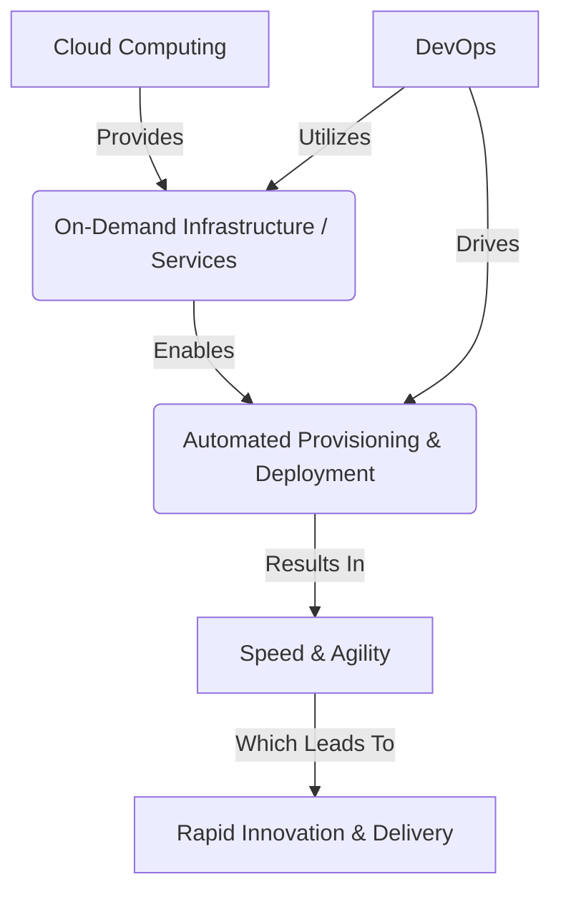

# Day 1: Introduction to AWS and DevOps 🌐☁️

Welcome to Day 1! This module covers the foundational principles of DevOps and introduces the suite of AWS services that enable DevOps practices.

## 🔄 Overview of DevOps Principles

DevOps is a combination of cultural philosophies, practices, and tools designed to increase an organization's ability to deliver applications and services at high velocity.

| Principle | Description | Tool/Practice Example |
| :--- | :--- | :--- |
| **Continuous Integration (CI)** | Automatically building and testing code every time a team member commits changes. | Jenkins, AWS CodeBuild, GitHub Actions |
| **Continuous Deployment (CD)** | Automatically deploying all code changes to a testing or production environment after the build stage. | AWS CodeDeploy, ArgoCD |
| **Infrastructure as Code (IaC)** | Managing and provisioning data centers through machine-readable definition files, rather than physical hardware configuration or interactive configuration tools. | AWS CloudFormation, Terraform |
| **Automation** | Reducing or eliminating manual workflows to improve speed, reliability, and consistency. | Python scripts, Shell scripts, Automating test suites |

## 🖥️📦 Introduction to AWS Services for DevOps

Amazon Web Services (AWS) provides a set of flexible services designed to enable companies to more rapidly and reliably build and deliver products using DevOps practices.

### Core Service Mapping

| AWS Service | Category | DevOps Role |
| :--- | :--- | :--- |
| **EC2** (Elastic Compute Cloud) | Compute | Virtual servers for running applications. |
| **S3** (Simple Storage Service) | Storage | Storing artifacts, backups, and static website files. |
| **RDS** (Relational Database Service) | Database | Managed relational databases (MySQL, PostgreSQL, etc.). |
| **Lambda** | Compute | Serverless compute; run code without provisioning servers. |
| **CloudFormation** | Management/IaC | Automate the creation and management of AWS resources. |
| **CloudWatch** | Monitoring | Track metrics, collect logs, and set alarms. |
| **EKS/ECS** | Containers | Managed Kubernetes (EKS) / Elastic Container Service (ECS). |
| **ECR** | Containers | Elastic Container Registry (store Docker images). |
| **CodePipeline** | CI/CD | Fully managed continuous delivery service. |

## 🚀 The Synergy Between Cloud Computing and DevOps

Cloud computing and DevOps are entirely complementary.

### Benefits of Adopting AWS for DevOps:
1. **Get Started Fast**: No hardware to buy, ready-to-use services.
2. **Fully Managed Services**: Less time managing infrastructure, more time building.
3. **Built for Scale**: Handle a single instance or thousands seamlessly.
4. **Programmable**: Native SDKs, APIs, and CLI tools.
5. **Secure**: Robust access management (IAM) and network isolation (VPC).
