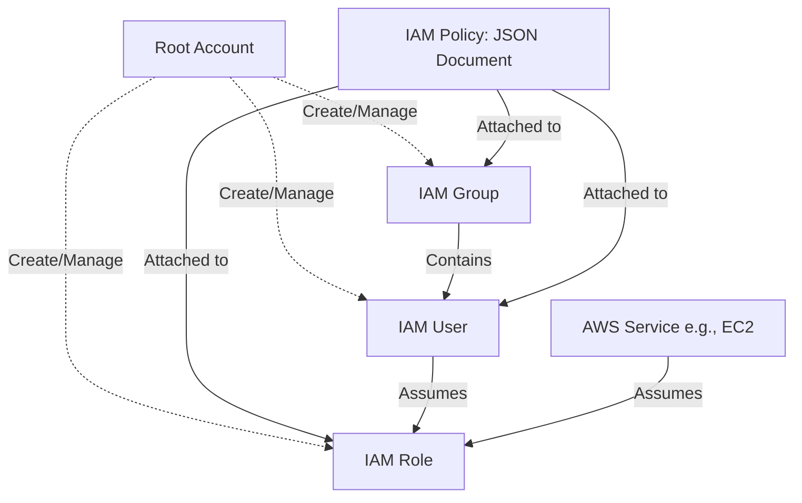

# Day 2: Setting up an AWS Account and IAM 🔐📋

Security is "Job Zero" at AWS. This module covers setting up your account securely and mastering Identity and Access Management (IAM).

## 🛡️ Overview of AWS IAM

IAM enables you to manage access to AWS services and resources securely. It allows you to create and manage AWS users and groups, and use permissions to allow or deny their access to AWS resources.



## 👥 Core IAM Components

| Component | Definition | Example Use Case |
| :--- | :--- | :--- |
| **User** | Represents a person or service interacting with AWS. | "Alice" logs into the console to view an S3 bucket. |
| **Group** | A collection of IAM users. | "Developers" group with read/write access to certain services. |
| **Role** | An identity that you can assume to gain temporary permissions. | An EC2 instance assuming a role to read files from S3. |
| **Policy** | A JSON document that defines what actions are allowed or denied. | `{ "Effect": "Allow", "Action": "s3:GetObject", "Resource": "*" }` |

## 🔒 Best Practices for Securing Your Account

Securing the Root account is the most critical first step when opening a new AWS account.

| Practice | Description | Why it's Important |
| :--- | :--- | :--- |
| **Lock Away Root Account** | The root account has unrestricted access. Do not use it for everyday tasks. | Prevents complete account takeover if credentials are stolen. |
| **Enable MFA (Multi-Factor Authentication)** | Require a physical device (like Google Authenticator) in addition to a password. | Drastically reduces the risk of credential compromise. |
| **Create Individual IAM Users** | Everyone gets their own login credentials. | Allows for auditing (CloudTrail) to see exactly *who* did *what*. |
| **Use Groups to Assign Permissions** | Attach policies to groups, not individual users. | Easier management; when someone joins the "DBA" team, just add them to the group. |
| **Apply strong Password Policies** | Enforce length, complexity, and rotation. | Prevents brute-force attacks and weak passcodes. |

## ✍️ Writing IAM Policies for Least-Privilege

**Principle of Least-Privilege**: Granting only the permissions required to perform a task, and nothing more.

**Example Policy Breakdown (Allowing read-only access to a specific S3 bucket):**

```json
{
  "Version": "2012-10-17",
  "Statement": [
    {
      "Effect": "Allow",               // Will this action be Allowed or Denied?
      "Action": [                      // What specific actions?
        "s3:GetObject",
        "s3:ListBucket"
      ],
      "Resource": [                    // On what specific resources?
        "arn:aws:s3:::my-secure-bucket",
        "arn:aws:s3:::my-secure-bucket/*"
      ]
    }
  ]
}
```
