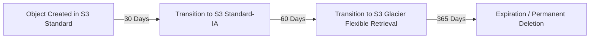

# Day 5: S3 and Cloud Storage in DevOps 📦☁️

Amazon Simple Storage Service (Amazon S3) is an object storage service offering industry-leading scalability, data availability, security, and performance.

## 📂 S3 Core Concepts

*   **Buckets**: Logical containers for storing objects. Bucket names must be globally unique across all of AWS.
*   **Objects**: The fundamental entities stored in S3 (e.g., your files). Each object is identified by a key (name).

## 🔄 Versioning and Lifecycle Policies

S3 allows you to automate data management to reduce costs and protect against accidental deletion.

| Feature | Description | Use Case in DevOps |
| :--- | :--- | :--- |
| **Versioning** | Keeps multiple variants of an object in the same bucket. | If a junior dev accidentally overwrites a CloudFormation template in S3, you can easily restore the previous version. |
| **Lifecycle Policies** | A set of rules that define actions that S3 applies to a group of objects. | Moving old application log files to cheap Glacier storage after 30 days to save money. |

## 🗄️ Storage Classes Comparison

Selecting the right storage class is critical for cost optimization.

| Storage Class | Designed For | Access Time | Cost Profile |
| :--- | :--- | :--- | :--- |
| **S3 Standard** | Frequently accessed data. | Milliseconds | Higher storage cost, low access cost. |
| **S3 Standard-IA** | Long-lived, infrequently accessed data. | Milliseconds | Lower storage cost, higher access cost. |
| **S3 Glacier Flexible Retrieval** | Long-term backups and archives. | Minutes to Hours | Very low storage cost, high access cost. |
| **S3 Intelligent-Tiering** | Data with unknown or changing access patterns. | Milliseconds | Automatically moves data to the most cost-effective tier. |

## 🛡️ S3 Security and Access Control

By default, all S3 buckets are private. You control access using several mechanisms:

1.  **IAM Policies**: Specify what IAM users/roles can do (e.g., "User X can write to Bucket Y").
2.  **Bucket Policies**: Attached directly to the bucket. Useful for cross-account access or making a bucket totally public (like a website).
3.  **Block Public Access**: An account-level or bucket-level setting that overrides any policies that make the bucket public. Highly recommended to keep turned ON for private data.

## 🛠️ Use Cases for S3 in DevOps Workflows

| DevOps Use Case | How S3 is Used |
| :--- | :--- |
| **Storing Build Artifacts** | CI systems (like Jenkins) push compiled code (JARs, ZIPs) to S3 before deployment. |
| **Infrastructure as Code (IaC)** | Terraform State files and CloudFormation templates are centrally stored in S3. |
| **Log Aggregation** | Load balancers, CloudTrail, and application servers dump logs into S3 for long-term auditing. |
| **Static Website Hosting** | Hosting raw HTML/CSS/JS for frontend applications (often served via CloudFront). |
