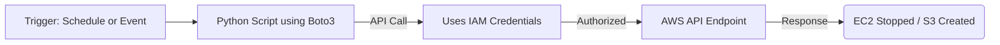

# Day 6: Automation with AWS CLI & SDK 🤖💻

Interacting with the AWS Management Console (GUI) is great for learning, but true DevOps requires interacting with AWS programmatically.

## ⚙️ Connecting to AWS

You have two primary programmatic ways to interact with AWS APIs:

| Tool | AWS CLI (Command Line Interface) | AWS SDK (Software Development Kit) |
| :--- | :--- | :--- |
| **What is it?** | A unified command-line tool. | Language-specific libraries (e.g., Python, Java). |
| **Best For** | Quick administration, bash/shell scripting, CI pipelines. | Complex automation, application logic, try/catch error handling. |
| **Examples** | `aws s3 cp`, `aws ec2 start-instances` | Boto3 (Python): `s3.create_bucket()` |
| **Return Type**| JSON or Text (needs parsing like `jq`). | Native language objects (Dictionaries, Lists). |

## 📜 Essential AWS CLI Commands Cheat Sheet

Before running these, you must run `aws configure` to provide your Access Key ID and Secret Access Key.

| Task | Command |
| :--- | :--- |
| **List S3 Buckets** | `aws s3 ls` |
| **Upload file to S3**| `aws s3 cp my-file.txt s3://my-bucket/` |
| **Sync folder to S3**| `aws s3 sync ./my-assets s3://my-bucket/` |
| **List EC2 Instances**| `aws ec2 describe-instances --query 'Reservations[*].Instances[*].[InstanceId,State.Name]' --output table` |
| **Stop EC2 Instance**| `aws ec2 stop-instances --instance-ids i-0abcdef1234567890` |
| **Get Caller Identity**| `aws sts get-caller-identity` (Like `whoami` for AWS) |

## 🐍 Introduction to Boto3 (AWS SDK for Python)

Boto3 makes it incredibly easy to automate AWS tasks if you know basic Python.

### Automation Workflow Diagram



### Script Example: Stopping all instances tagged "Dev"

```python
import boto3

def stop_dev_instances():
    # Initialize the EC2 client
    ec2 = boto3.client('ec2', region_name='us-east-1')

    # Filter instances by the 'Environment' tag matching 'Dev'
    filters = [{'Name': 'tag:Environment', 'Values': ['Dev']},
               {'Name': 'instance-state-name', 'Values': ['running']}]
    
    response = ec2.describe_instances(Filters=filters)
    
    instance_ids = []
    for reservation in response['Reservations']:
        for instance in reservation['Instances']:
            instance_ids.append(instance['InstanceId'])
            
    if instance_ids:
        print(f"Stopping instances: {instance_ids}")
        ec2.stop_instances(InstanceIds=instance_ids)
    else:
        print("No running Dev instances found.")

if __name__ == '__main__':
    stop_dev_instances()
```

## 🔄 Automating Repetitive Workflows

By combining CLI/SDK scripts with scheduling tools (like cron or AWS EventBridge), you can build powerful automation:
*   **Cost Savings**: Script to stop all development EC2 instances at 6 PM every Friday and start them at 8 AM Monday.
*   **Security**: Script to query all S3 buckets and alert if any are marked "Public".
*   **Backups**: Script to trigger EBS snapshots every night.
