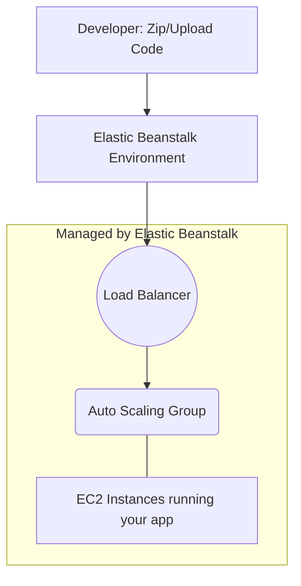

# Day 8: Introduction to AWS Elastic Beanstalk 🌱📦

AWS Elastic Beanstalk is an easy-to-use service for deploying and scaling web applications and services developed with Java, .NET, PHP, Node.js, Python, Ruby, Go, and Docker on familiar servers such as Apache, Nginx, Passenger, and IIS.

## ☁️ Understanding Cloud Service Models

To understand Elastic Beanstalk, you must understand where it fits in the cloud model.

| Model | What it stands for | You Manage | AWS Manages | Example |
| :--- | :--- | :--- | :--- | :--- |
| **IaaS** | Infrastructure as a Service | Apps, Data, Runtime, OS | Virtualization, Servers, Storage, Networking | AWS EC2 |
| **PaaS** | Platform as a Service | Apps, Data | Runtime, OS, Virtualization, Servers, Storage, Networking | **Elastic Beanstalk** |
| **SaaS** | Software as a Service | Nothing | Everything | Gmail, Salesforce |

## 🚀 How Elastic Beanstalk Works

With Beanstalk, you simply upload your code, and the service automatically handles the deployment, from capacity provisioning, load balancing, and auto-scaling to application health monitoring.

## ⚙️ Key Concepts in Elastic Beanstalk

| Concept | Definition |
| :--- | :--- |
| **Application** | A logical collection of Elastic Beanstalk components, including environments, versions, and configurations. |
| **Application Version** | A specific, labeled iteration of deployable code. |
| **Environment** | A version deployed onto AWS resources. You might have a `Dev` environment and a `Prod` environment for the same application. |
| **Environment Tier** | Two types: **Web Server** (handles HTTP requests) and **Worker** (handles background tasks from SQS). |

## 🔄 Updating Applications and Rolling Back

Elastic Beanstalk offers several deployment policies to handle how updates are pushed to your instances:

| Deployment Policy | How it works | Downtime Impact |
| :--- | :--- | :--- |
| **All at once** | Deploys the new version to all instances simultaneously. | Short downtime while existing servers restart. |
| **Rolling** | Deploys the new version in batches. | No downtime, but capacity is temporarily reduced. |
| **Rolling with add'l batch** | Provisions a new batch of instances, deploys to them, then continues rolling. | No downtime, maintains full capacity. |
| **Immutable** | Deploys the new version to a fresh Auto Scaling group, then switches traffic. | No downtime, safest option, easy rollback. |

Rollbacks are easy: just select a previous **Application Version** and click "Deploy". Beanstalk handles the rest.

## 📊 Elastic Beanstalk vs. Traditional Infrastructure Management

| Feature | Elastic Beanstalk | Traditional (Raw EC2) |
| :--- | :--- | :--- |
| **Setup Time** | Minutes. Just upload code. | Hours/Days. Manual OS config, LB setup. |
| **Control** | Retain full control over underlying EC2 instances if needed. | Complete control over everything. |
| **Learning Curve** | Low. Abstracted complexity. | High. Must understand networking, scaling, etc. |
| **Best for** | Rapid prototyping, web apps, teams without dedicated ops engineers. | Highly custom architectures, specialized networking. |
