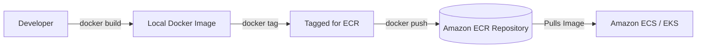

# Day 10: Containerization with ECS & ECR 🐳📦

Containerization packages an application and its dependencies into a standard unit for software development. AWS provides robust services for storing and running these containers.

## 📂 Introduction to Containerization

Containers isolate software from its environment and ensure that it works uniformly despite differences for instance between development and staging.

### Virtual Machines vs. Containers

| Feature | Virtual Machines | Containers (Docker) |
| :--- | :--- | :--- |
| **Isolation Level** | Hardware-level virtualization | OS-level virtualization |
| **Size** | Large (Gigabytes) | Small (Megabytes) |
| **Startup Time** | Slow (Minutes) | Fast (Seconds) |
| **Portability** | Limited | High (Write once, run anywhere) |

## 🐋 ECR: Elastic Container Registry

Amazon ECR is a fully managed container registry that makes it easy to store, manage, share, and deploy your container images and artifacts. (It's AWS's secure equivalent to Docker Hub).

### Docker to ECR Workflow

## 📊 ECS Basics: Clusters, Tasks, and Services

Amazon Elastic Container Service (ECS) is a highly scalable, high-performance container orchestration service. 

| ECS Concept | Definition | Docker Equivalent (roughly) |
| :--- | :--- | :--- |
| **Cluster** | A logical grouping of tasks or services. | A Docker Swarm |
| **Task Definition** | A blueprint that describes how a docker container should launch (image, memory/CPU, ports). | `docker-compose.yml` or `docker run` args |
| **Task** | The instantiation of a Task Definition (the actual running container). | A running Docker container |
| **Service** | Ensures that a specified number of tasks are constantly running and restarts them if they fail. | Daemon / Replica Set |

## ⚙️ Computing Platforms: EC2 vs Fargate

When running tasks on ECS, you must choose the underlying infrastructure.

| Feature | ECS on EC2 Instances | ECS on AWS Fargate |
| :--- | :--- | :--- |
| **Management** | You manage the underlying EC2 instances (updates, scaling the cluster). | **Serverless**. AWS manages the underlying infrastructure. |
| **Pricing** | You pay for the EC2 instances running, regardless of container usage. | You pay only for the exact CPU and memory consumed by running tasks. |
| **Control** | Full control over the host OS. Better for GPU workloads or highly custom networking. | No access to the host OS. |
| **Best For** | Predictable workloads, cost-optimization at scale. | Unpredictable workloads, small teams, prioritizing speed to deployment. |
