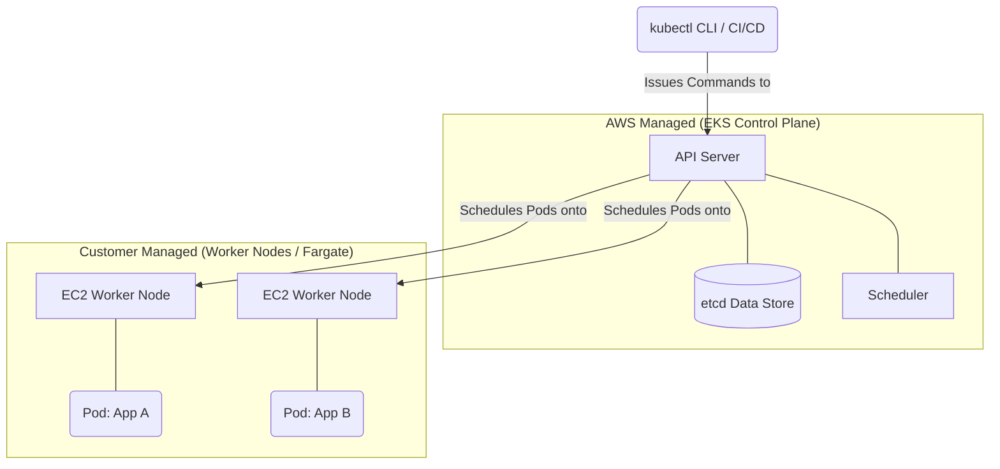

# Day 11: Kubernetes on AWS with EKS ☸️☁️

Kubernetes (K8s) is an open-source system for automating deployment, scaling, and management of containerized applications. Amazon Elastic Kubernetes Service (EKS) is a managed service that makes it easy to run Kubernetes on AWS without needing to install, operate, and maintain your own Kubernetes control plane or nodes.

## 🤖 EKS Architecture

Running your own Kubernetes cluster is difficult because the "Control Plane" is complex to manage and scale. EKS manages it for you.

## 📦 Core Kubernetes Objects

When managing applications on EKS, you deploy "objects" using YAML files and the `kubectl` command-line tool.

| Kubernetes Object | What it does | DevOps Context |
| :--- | :--- | :--- |
| **Pod** | The smallest deployable computing unit. Encapsulates one or more containers. | Your Docker container runs inside a Pod. |
| **Deployment** | Specifies how many replicas of a Pod should run. Handles rolling updates. | You write a Deployment YAML to tell EKS "I want 3 copies of my web app running." |
| **Service** | An abstract way to expose an application running on a set of Pods as a network service. | Gives your 3 Pods a single, stable internal IP address. |
| **Ingress** | Exposes HTTP and HTTPS routes from outside the cluster to services within the cluster. | Connects to an AWS Application Load Balancer to route internet traffic to your Service. |

## 🔌 Integrating EKS with AWS Services

EKS is powerful because it integrates natively with other AWS services.

| AWS Service | Integration Purpose | Mechanism |
| :--- | :--- | :--- |
| **IAM** | Authentication to the cluster and granting Pods permissions to access AWS services (like S3). | **IAM Roles for Service Accounts (IRSA)** |
| **CloudWatch** | Viewing K8s cluster logs and control plane logs. | **Fluent Bit / CloudWatch Agent** |
| **ECR** | Pulling secure container images to run in Pods. | Kubelet uses the underlying node's IAM role to authenticate to ECR. |
| **VPC** | Assigning native AWS IP addresses to Pods. | **Amazon VPC CNI plugin for Kubernetes** |

## 📈 Scaling Workloads in EKS

| Scaling Type | Component Scaled | AWS K8s Tool |
| :--- | :--- | :--- |
| **Horizontal Pod Autoscaler (HPA)** | The number of Pods running. | HPA controller (native to K8s) scales based on CPU/Memory metrics. |
| **Cluster Autoscaler (CA) or Karpenter**| The number of EC2 Worker Nodes. | Automatically provisions new EC2 instances when Pods are pending due to lack of resources. |
