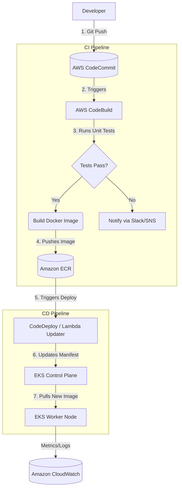

# Day 15: End-to-End Project: CI/CD Pipeline with EKS 🚀🔄

This final project brings together everything you've learned. You will construct a complete, secure, and automated deployment pipeline targeting an Amazon EKS cluster.

## 🏗️ The End-to-End Architecture

## ✅ Step-by-Step Implementation Checklist

| Step | Action Item | Services Used |
| :--- | :--- | :--- |
| **1. Infra Setup** | Provision VPC, Subnets, and the EKS Cluster. | CloudFormation / Terraform |
| **2. Storage Setup** | Create an ECR repository to hold the Docker images. | ECR |
| **3. App Repository** | Initialize git repo, push Dockerfile and `buildspec.yml`. | CodeCommit |
| **4. Build Config** | Configure CodeBuild to read `buildspec.yml`, run tests, build the image, and push to ECR. | CodeBuild, IAM (Permissions to push to ECR) |
| **5. Deploy Config** | Create deployment logic (e.g., a script that runs `kubectl set image...` or triggers ArgoCD). | CodeDeploy / Lambda |
| **6. The Pipeline** | Tie it all together in CodePipeline. Link the Source, Build, and Deploy stages. | CodePipeline |
| **7. Security integration**| Integrate a tool (e.g. Trivy) in the CodeBuild stage to scan the image before pushing to ECR. | CodeBuild, Security Tools |
| **8. Observability** | Verify the application is running, and configure a CloudWatch dashboard for node CPU metrics. | CloudWatch, EKS |

## 🤝 Project Review and Summary

If your pipeline works successfully, whenever a developer updates the application code and pushes it to the main branch, the following happens automatically in minutes:

1. The code is tested.
2. A new un-tampered image is built and securely stored in AWS.
3. The EKS cluster gracefully performs a rolling update to the new version without downtime.
4. Monitoring is continuously active to ensure the new version doesn't crash.

**Congratulations on completing the 15-Day AWS DevOps Series!**
