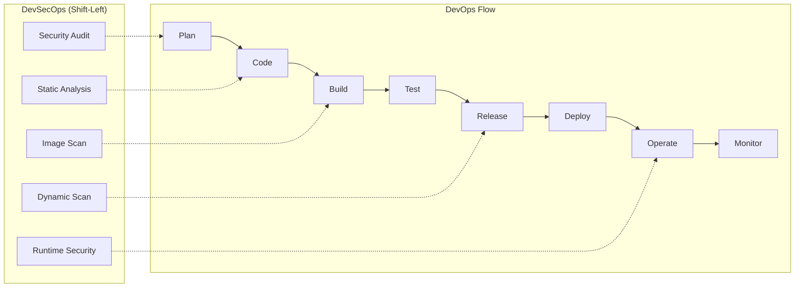

# Module 1 | DevOps & DevSecOps Introduction

This module provides a foundational understanding of DevOps and its security-focused evolution, DevSecOps.

## 🌟 Concepts at a Glance

### 1. What is DevOps & DevSecOps?

| Feature | DevOps | DevSecOps |
| :--- | :--- | :--- |
| **Primary Goal** | Velocity & Quality | Velocity & Security |
| **Philosophy** | Silo breakdown (Dev & Ops) | Silo breakdown (Dev, Security, & Ops) |
| **Security Phase** | Often at the very end | Integrated from the start (Shift-Left) |
| **Core Value** | Continuous Delivery | Continuous Trust |

### 2. DevOps vs DevSecOps Lifecycle

## 📈 Real-Time Corporate Workflow

A typical production-ready workflow for a modern tech company:

1.  **Requirement Gathering** (Plan)
2.  **Feature Development** (Code) - *Git branching starts here.*
3.  **Continuous Integration** (Build & Scan) - *Maven/NPM build + SonarQube.*
4.  **Artifact Storage** (Nexus/Artifactory) - *Versioning images/binaries.*
5.  **Continuous Deployment** (CD) - *Jenkins/ArgoCD to K8s.*
6.  **Monitoring & Response** (Monitor) - *Prometheus alerts.*

## 🚀 Deployment Strategies

| Strategy | Description | Pros | Cons |
| :--- | :--- | :--- | :--- |
| **Recreate** | Terminate old version, then start new. | Simple, no dual versioning. | Downtime. |
| **Rolling** | Update instances one by one. | No downtime. | Multiple versions active at once. |
| **Blue/Green** | Deploy to a new environment, then switch traffic. | Zero downtime, instant rollback. | Expensive (Double infrastructure). |
| **Canary** | Roll out to a small subset of users first. | Safest; tests on real traffic. | Complex routing. |

---
**Preparation Tip**: Be ready to explain "Shift-Left" security—it's a favorite interview question!
