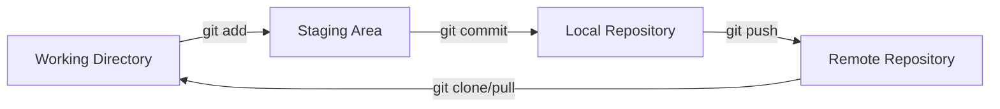
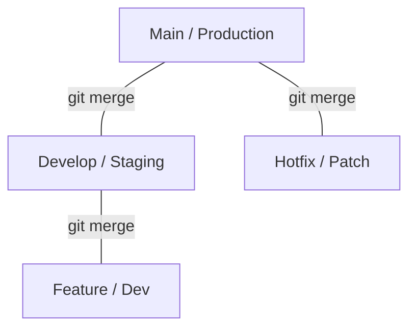

# Module 3 | Git Version Control

Git is the foundation for modern collaborative development. This guide simplifies Git's concepts using visual states, comparison tables, and branching flowcharts.

## 🔄 Git States & Lifecycle

Understanding the **"Where"** of your code:

## 🛠️ Essential Git Commands

| Action | Command | Description |
| :--- | :--- | :--- |
| **Setup** | `git config` | Set user name and email. |
| **Save** | `git add .`, `git commit` | Stage and save changes locally. |
| **Sync** | `git pull`, `git push` | Get and send changes to the remote. |
| **History** | `git log --oneline` | View abbreviated commit history. |
| **Branch** | `git checkout -b <name>` | Create and switch to a new branch. |
| **Undo** | `git reset --hard` | Revert to a specific commit (be careful!). |

## 🌴 Branching & Merging

| Merge Strategy | How It Works | Best Use Case |
| :--- | :--- | :--- |
| **Fast-forward** | Points the branch tip to the new commit. | Simple, linear changes. |
| **Three-way Merge** | Creates a new merge commit. | Parallel work on different branches. |
| **Rebase** | Re-applies commits on top of another base. | Keeping a clean, linear history. |

## 🌳 Corporate Branching Strategy

A typical enterprise-level workflow:

### Common Branch Types:

- **`main`**: Always contains production-ready code.
- **`develop`**: For integration of all finished features.
- **`feature/*`**: For developing individual features/bugs.
- **`hotfix/*`**: For urgent production fixes.

---
**Preparation Tip**: Make sure you know the difference between `git pull` and `git fetch`.
- `git fetch`: Downloads changes but doesn't change your code.
- `git pull`: Downloads and merges changes instantly.
