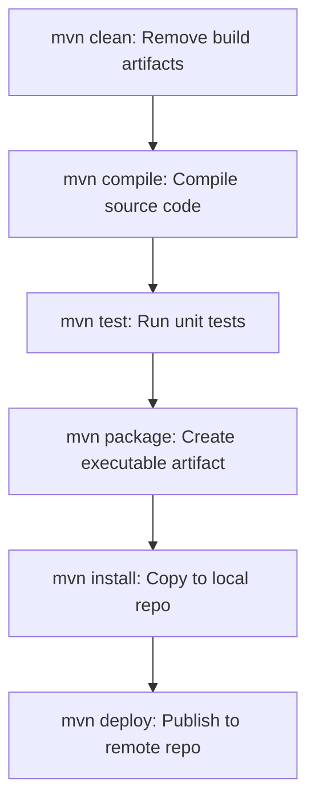

# Module 4 | Build Tools (Maven & NPM)

Build tools automate the process of compiling, testing, and packaging code into production-ready artifacts. This guide compares the two most popular tools in the ecosystem: Apache Maven and NPM.

## 🏗️ Build Tool Comparison: Maven vs NPM

| Feature | Apache Maven | NPM (Node Package Manager) |
| :--- | :--- | :--- |
| **Language Support** | Primarily **Java** | Primarily **JavaScript** |
| **Configuration File**| `pom.xml` | `package.json` |
| **Dependency Mgmt** | Defined in `<dependencies>` | Defined in `"dependencies"` |
| **Build Artifact** | JAR, WAR, EAR | Node modules, transpiled JS |
| **Repository** | Maven Central | NPM Registry |
| **Lifecycle Phases** | Standardized (Clean, Compile, Test, Package, Install, Deploy) | Script-based (Pre, Post, Custom scripts) |

## 📦 Maven Lifecycle Flowchart



## 📜 Maven `pom.xml` Overview

```xml
<project>
  <modelVersion>4.0.0</modelVersion>
  <groupId>com.devsecops</groupId>
  <artifactId>my-app</artifactId>
  <version>1.0.0</version>
  <dependencies>
      <dependency>
          <groupId>junit</groupId>
          <artifactId>junit</artifactId>
          <version>4.13</version>
      </dependency>
  </dependencies>
</project>
```

## 📜 NPM `package.json` Overview

```json
{
  "name": "my-app",
  "version": "1.0.0",
  "scripts": {
    "start": "node app.js",
    "test": "jest",
    "build": "webpack"
  },
  "dependencies": {
    "express": "^4.17.1"
  }
}
```

---
**Preparation Tip**: Make sure you know the difference between `mvn package` and `mvn install`.
- `mvn package`: Creates the JAR/WAR file in the `target` directory.
- `mvn install`: Also copies the JAR/WAR file to your local `.m2` repository so other projects on your machine can use it.
