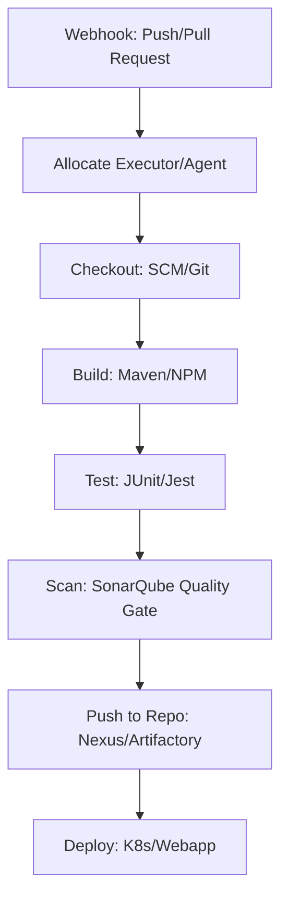

# Module 5 | CI/CD Tools (Jenkins, GitHub Actions, GitLab CI/CD)

Continuous Integration and Continuous Deployment (CI/CD) is the heart of DevSecOps. It automates the software delivery process from code commit to production deployment.

## 🛠️ CI/CD Tool Comparison Table

| Feature | Jenkins | GitHub Actions | GitLab CI/CD |
| :--- | :--- | :--- | :--- |
| **Model** | Self-hosted / Traditional | Cloud-native / Managed | Native to GitLab Platform |
| **Configuration** | `Jenkinsfile` (Groovy) | `.github/workflows/*.yml` | `.gitlab-ci.yml` |
| **Plugin Ecosystem** | Massive, 1800+ plugins | Actions from Marketplace | Built-in features |
| **Integrations** | Extremely versatile | GitHub-native | GitLab-native |
| **Scalability** | Distributed (Masters/Nodes) | Runner-based (GitHub-hosted/Self) | Runner-based |
| **Security** | RBAC, Secrets Mgmt | Repository-level secrets | Group/Project-level secrets |

## 📦 Jenkins Pipeline Workflow



---

## 📜 Jenkinsfile (Declarative Syntax Example)

```groovy
pipeline {
    agent any
    stages {
        stage('Checkout') {
            steps { git 'https://github.com/repo.git' }
        }
        stage('Build') {
            steps { sh 'mvn clean install' }
        }
        stage('SonarQube Scan') {
            steps { /* SonarQube Scanner */ }
        }
        stage('Deploy') {
            steps { /* AWS/K8s Deploy */ }
        }
    }
}
```

## 📜 GitHub Actions (YAML Syntax Example)

```yaml
name: CI-CD-Pipeline
on: [push]
jobs:
  build:
    runs-on: ubuntu-latest
    steps:
      - uses: actions/checkout@v2
      - name: Setup JDK
        uses: actions/setup-java@v2
        with: { java-version: '11' }
      - name: Build and Test
        run: mvn clean test
```

---
**Preparation Tip**: Be ready to explain the difference between a **Freestyle** and a **Pipeline** job in Jenkins.
- **Freestyle**: GUI-based, easy for small tasks.
- **Pipeline**: Code-based (Pipeline as Code), versionable, and scalable for complex workflows.
