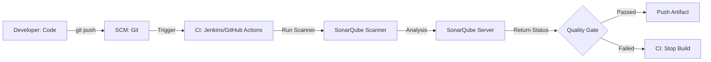

# Module 6 | SonarQube Quality Gate

SonarQube is the industry leader for **Static Application Security Testing (SAST)**. it analyzes code for bugs, vulnerabilities, and code smells.

## 🔍 Quality Analysis Flow

## 📊 Key Metrics Explained

| Metric | Definition | Importance |
| :--- | :--- | :--- |
| **Bugs** | Functional errors in code. | Prevents application crashes. |
| **Vulnerabilities**| Potential security risks. | Prevents cyber attacks (SQLi, XSS). |
| **Code Smells** | Maintainability issues. | Reduces technical debt and complexity. |
| **Duplications** | Repeated code blocks. | Improves modularity and cleanup. |
| **Test Coverage** | Code executed during tests. | Ensures robust testing practices. |

## 🚪 What is a Quality Gate?

A **Quality Gate** is a set of conditions that must be met before a project can be released.

**Example Conditions:**
1.  **Vulnerabilities**: Must be 0 (Critical/Blocker).
2.  **Code Coverage**: Must be at least 80%.
3.  **Duplicated Lines**: Must be less than 3%.
4.  **Maintainability Rating**: Must be A.

## 🛠️ Typical Webhook Setup

SonarQube can send a **Webhook** back to the CI tool (like Jenkins) to inform it whether the Quality Gate has passed or failed. This allows the CI pipeline to **"fail the build"** if the code doesn't meet quality standards.

---
**Preparation Tip**: Be ready to explain the difference between **SAST** and **DAST**.
- **SAST (Static)**: Scans source code without running it (SonarQube).
- **DAST (Dynamic)**: Scans the running application for vulnerabilities (OWASP ZAP).
