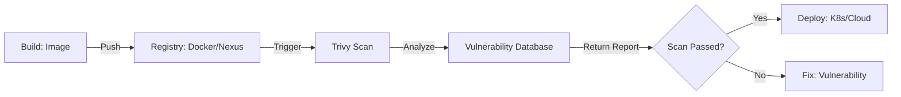

# Module 7 | Security Scanning Tools

In DevSecOps, security is integrated at every stage of the lifecycle. This guide maps various scanning tools to their specific purposes.

## 🛡️ The DevSecOps Security Toolchain

| Tool | Scanning Type | What It Scans | When To Run |
| :--- | :--- | :--- | :--- |
| **Checkmarx/Sonar** | **SAST** | Source Code (Bugs, Vulnerabilities) | Code/Build |
| **Trivy** | **Vulnerability Scan** | Docker Images, OS, Filesystem | Build/Artifact |
| **OWASP Dependency** | **SCA** | Library Dependencies (CVEs) | Build |
| **Prowler/Dockle** | **AWS/K8s Audit** | Cloud Config, Container Best Practices| Deploy |
| **OWASP ZAP** | **DAST** | Running Application (HTTP/API) | Testing/Post-Deploy |
| **HashiCorp Vault** | **Secret Mgmt** | Passwords, Keys, Tokens | Operational |

## 📦 Trivy: Image Scanning Flow

## 🔒 What is SCA (Software Composition Analysis)?

SCA tools like **OWASP Dependency-Check** analyze the libraries your application uses and compare them against known vulnerability databases (CVEs).

**Example Report:**
- **App**: `my-python-app`
- **Library**: `Django 2.2.0`
- **CVE**: `CVE-2019-14234` (High Severity)
- **Fix**: Upgrade to `Django 2.2.4`

## 🔑 HashiCorp Vault

Vault is used to manage secrets and protect sensitive data.

| Feature | Description |
| :--- | :--- |
| **Secrets Engine** | Store and manage static/dynamic secrets. |
| **Authentication** | Control access using LDAP, AppRole, etc. |
| **Policies** | Fine-grained control over secret access. |
| **Audit Logs** | Track every request to the Vault server. |

---
**Preparation Tip**: Be ready to explain the difference between **False Positives** and **Vulnerabilities**.
- **Vulnerability**: A confirmed security risk that needs to be fixed.
- **False Positive**: A tool incorrectly identifies something as a vulnerability.
- Always verify tool results manually or with additional scans!
