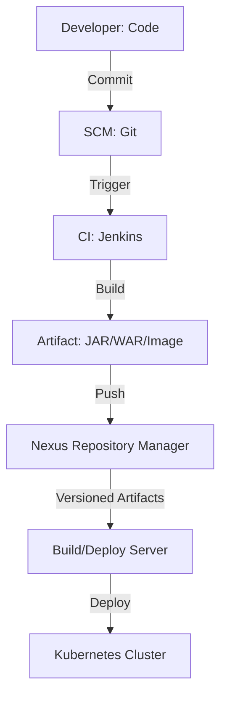

# Module 8 | Nexus Artifact Management

Artifact management is the practice of storing and managing computer software in its binary form. It's crucial for version control and securing dependencies.

## 📦 What is an Artifact?

An artifact is a file that is built from your source code and is ready for deployment.

| Type | Examples | Use Cases |
| :--- | :--- | :--- |
| **Java** | `my-app.jar`, `my-app.war` | Application binaries for JVM. |
| **JavaScript**| `.zip`, `.tar.gz` | Frontend/Node.js assets. |
| **Container** | `my-image:latest` | Docker/OCI containers. |
| **Python** | `my-app.whl` | Python wheel files. |

## 📦 Nexus Repository Architecture

## 📜 Nexus Repository Types

| Repository Type | Description | Purpose |
| :--- | :--- | :--- |
| **Hosted** | A repository that you manage on your own hardware. | Store project artifacts. |
| **Proxy** | A repository that points to a remote repository (e.g., Maven Central). | Cache external dependencies. |
| **Group** | A single endpoint that combines multiple repositories. | Ease of configuration. |

## 🛡️ Private Docker Registry in Nexus

A private registry is a secure way to store and manage your Docker images.

| Feature | Importance |
| :--- | :--- |
| **Security** | Only authorized users can push/pull images. |
| **Versioning** | Track images by tags (e.g., `:v1.0.0`, `:latest`). |
| **Audit Logs** | Track image access and modifications. |
| **Vulnerability Scanning** | Can often be integrated with tools like Trivy. |

---
**Preparation Tip**: Make sure you know why we use **Artifact Repositories** instead of just checking binaries into Git.
- Git is for **Source Code** (small files, change-based).
- Nexus is for **Binaries** (large files, version-based).
- Git is optimized for **Diffs**, Nexus is optimized for **Downloads**.
