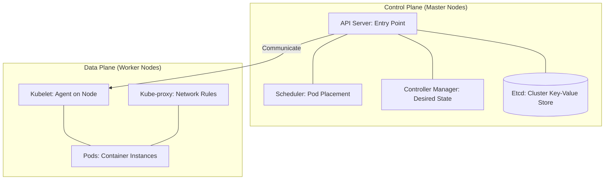
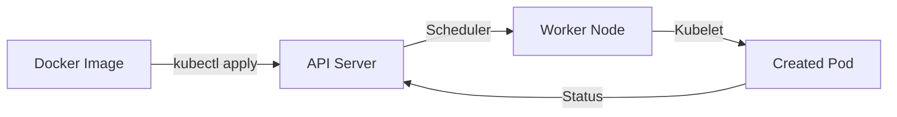

# Module 10 | Kubernetes Orchestration

Kubernetes (K8s) is an open-source platform for automating deployment, scaling, and operations of application containers across clusters of hosts.

## 🏗️ Kubernetes Architecture

## 📦 Key Kubernetes Objects

| Object | Description | Purpose |
| :--- | :--- | :--- |
| **Pod** | Smallest deployable unit (one or more containers). | Run the actual application code. |
| **Deployment** | Declarative updates for Pods and ReplicaSets. | Scaling, rollouts, and rollbacks. |
| **Service** | Stable network endpoint for Pods. | Load balancing and service discovery. |
| **Namespace** | Virtual cluster within a physical cluster. | Isolate projects or environments. |
| **ConfigMap** | Storing non-sensitive configuration data. | Separate code from configuration. |
| **Secret** | Storing sensitive data (e.g., passwords). | Protect secrets from exposure. |

## 🚀 Advanced K8s Concepts

| Concept | Action | Importance |
| :--- | :--- | :--- |
| **Ingress** | Manage HTTP/HTTPS external access to services. | Expose multiple services via a single IP. |
| **HPA/VPA** | Scale Pods based on CPU/Memory usage. | Handle traffic spikes automatically. |
| **Taints & Tolerations**| Control which Pods can run on specific nodes. | Group workloads or isolate bad nodes. |
| **Helm** | Package manager for Kubernetes (using Charts). | Simplify deployment of complex apps. |
| **ArgoCD** | GitOps tool for continuous deployment to K8s. | Automated syncing of Git state to K8s. |

## 🛠️ Typical K8s Workflow

---
**Preparation Tip**: Be ready to explain the difference between a **Service** and an **Ingress**.
- **Service**: In-cluster load balancing and name resolution.
- **Ingress**: External access, routing rules, and SSL termination.
