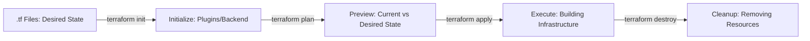
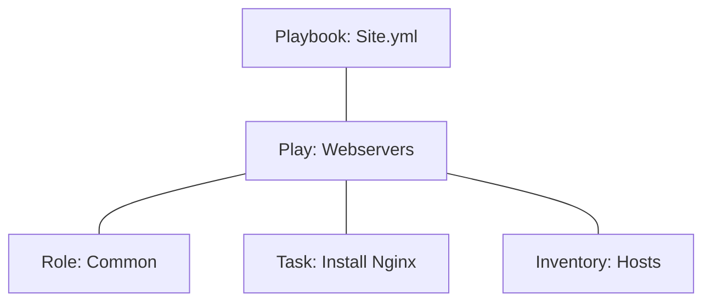

# Module 12 | Infrastructure as Code (IaC)

Infrastructure as Code (IaC) is the practice of managing and provisioning infrastructure through machine-readable configuration files.

## 🚀 IaC Tool Comparison: Terraform vs Ansible

| Feature | Terraform | Ansible |
| :--- | :--- | :--- |
| **Primary Goal** | Infrastructure Provisioning | Configuration Management |
| **Model** | **Declarative** (What is the final state?) | **Procedural/Hybrid** (How to get there?) |
| **Philosophy** | Immutable (Recreate on change) | Mutable (Modify existing) |
| **State** | **Stateful** (Tracks existing resources) | **Stateless** (Doesn't track state) |
| **Architecture** | Agentless (API/Provider based) | Agentless (SSH based) |

## 🛠️ Terraform Lifecycle Flow

## 📜 Ansible Playbook Architecture

### Key Differences:
- **Terraform** is used to create the server (EC2 instance, VPC, Subnet).
- **Ansible** is used to configure the server (Install packages, setup users, copy configs).

---
**Preparation Tip**: Be ready to explain why we use **Remote State** in Terraform.
- It allows teams to work together by locking the state file.
- It prevents accidental over-writes or deletions.
