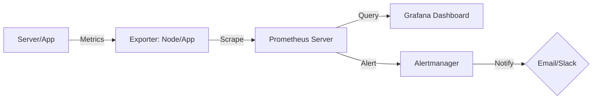

# Module 13 | Monitoring & Observability

Monitoring is the process of collecting, analyzing, and using information to track the performance and health of your systems.

## 📊 Monitoring Architecture

## 📈 Monitoring Tool Comparison: Prometheus vs ELK

| Feature | Prometheus | ELK Stack (Elasticsearch, Logstash, Kibana) |
| :--- | :--- | :--- |
| **Primary Data**| **Metrics** (CPU, RAM, Req Count) | **Logs** (Error msgs, Audit trails) |
| **Philosophy** | Pull-based (Scraping) | Push-based (Filtering) |
| **Alerting** | Built-in (Alertmanager) | Third-party or separate plugin |
| **Visualization**| Grafana (Native support) | Kibana (Native support) |
| **Use Case** | System/Performance Monitoring | Log Aggregation/Troubleshooting |

## 🚀 Monitoring in Kubernetes

| Component | Role | Importance |
| :--- | :--- | :--- |
| **Node Exporter** | Collect machine-level metrics (CPU, Memory). | Host-level visibility. |
| **Kube-state-metrics** | Collect K8s object-level metrics (Pod status). | Workload-level visibility. |
| **Alertmanager** | Route alerts based on severity and source. | Reduced notification noise. |
| **Grafana** | Create visual dashboards for K8s clusters. | Unified operational view. |

---
**Preparation Tip**: Be ready to explain the difference between **Metrics** and **Logs**.
- **Metrics**: Numbers over time (What's happening?).
- **Logs**: Detailed text events (Why it's happening?).
