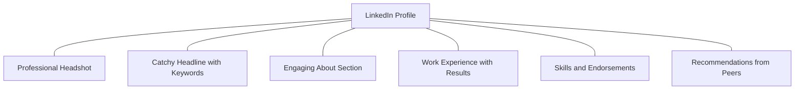

# Module 15 | Resume & Interview Prep

A professional resume and strong LinkedIn profile are your first steps to landing a DevSecOps job.

## 📄 Resume Optimization Checklist

| Section | Importance | Key Tips |
| :--- | :--- | :--- |
| **Contact Info** | Critical | Name, Email, Phone, LinkedIn, GitHub. |
| **Summary** | High | Professional summary highlighting key skills. |
| **Skills** | High | Group skills by category (e.g., Tools, Languages). |
| **Projects** | Critical | Highlight real-world DevSecOps projects. |
| **Experience** | High | Quantifiable achievements (e.g., "Reduced build time by 30%"). |
| **Certifications**| Moderate | AWS, Azure, CKA, CKAD, etc. |

## 🔗 LinkedIn Profile Optimization

## 🎙️ Common Interview Questions

| Category | Question | Tip |
| :--- | :--- | :--- |
| **Behavioral** | Tell me about a time you failed. | Use the STAR method (Situation, Task, Action, Result). |
| **Technical** | What is the difference between Git and GitHub? | Focus on Local vs Remote version control. |
| **DevSecOps** | What is "Shift-Left" security? | Integration of security from the very start. |
| **Scenario** | Your build failed. How do you troubleshoot?| Analyze logs, check dependencies, verify configs. |

---
**Preparation Tip**: Be ready to explain your **Ultimate Hands-On Projects** in detail. It's the best way to prove your expertise!
