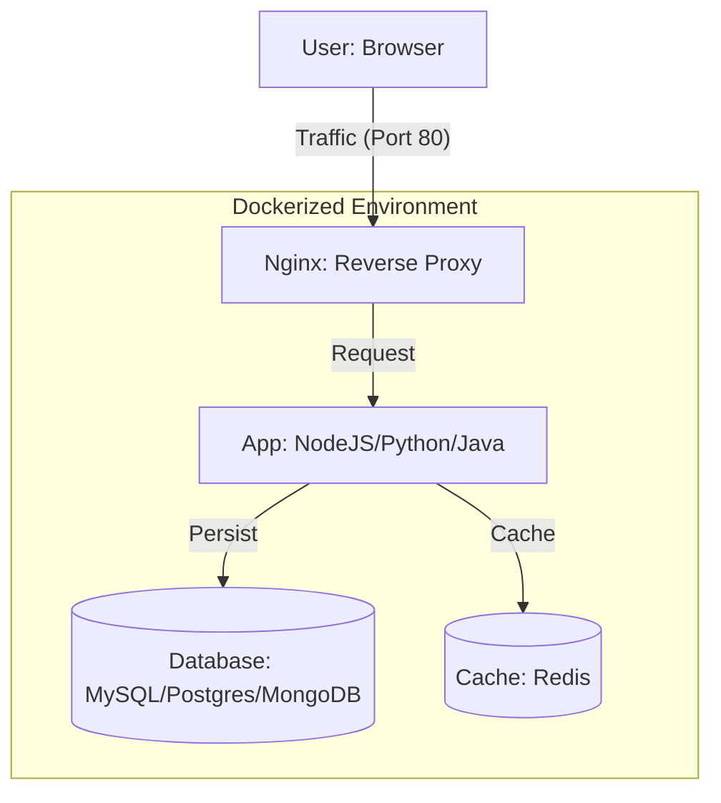
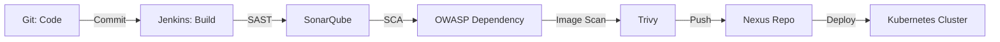

# Ultimate Hands-On Projects Matrix

This matrix maps the featured "Ultimate Projects" from the Batch-7 Bootcamp to the technologies and modules they reinforce. These projects are the best way to demonstrate your skills to recruiters.

## 🚀 Project-to-Technology Mapping

| Project Name | Primary Stack | Key Modules | Security Integrated |
| :--- | :--- | :--- | :--- |
| **Multitier NodeJS + MySQL** | Node.js, MySQL, Docker | 4, 8, 9 | Yes (Trivy) |
| **Multitier DotNet + MongoDB** | .NET Core, MongoDB, Docker | 4, 8, 9 | Yes (Trivy) |
| **Multitier Python + Postgres** | Python, PostgreSQL, Docker | 4, 8, 9, 14 | Yes (Trivy) |
| **Multitier Java + MySQL** | Java, MySQL, Maven, Docker | 4, 8, 9 | Yes (Trivy) |
| **Microservice Applications** | Docker, K8s, Spring Boot | 9, 10 | Yes (K8s Networking) |
| **Full Stack Projects in Java** | Java, Maven, Jenkins, AWS | 4, 5, 8 | Yes (SonarQube) |
| **Portfolio Website** | HTML, S3, CloudFront | 6 | No (Static Website) |
| **K8s Worker Node Monitoring** | Prometheus, Grafana, K8s | 10, 13 | Yes (Alertmanager) |
| **App Deployed in K8 Monitoring**| Prometheus, Grafana, K8s | 10, 13 | Yes (Alertmanager) |
| **Terraform & Ansible Project** | Terraform, Ansible, AWS | 12 | Yes (IaC Best Practices)|
| **Service Mesh with Istio** | Istio, K8s, Microservices | 10 | Yes (mTLS, RBAC) |

## 🏗️ Project Architecture Example (Multitier App)

## 📜 DevSecOps CI/CD Integration

For every project above, the following **DevSecOps Pipeline** should be implemented:

---
**Practical Tip**: When explaining these projects in interviews, focus on the **Challenges** you faced (e.g., "Troubleshooting container networking") and how you **Resolved** them.
