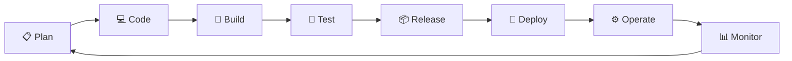
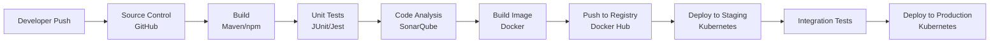
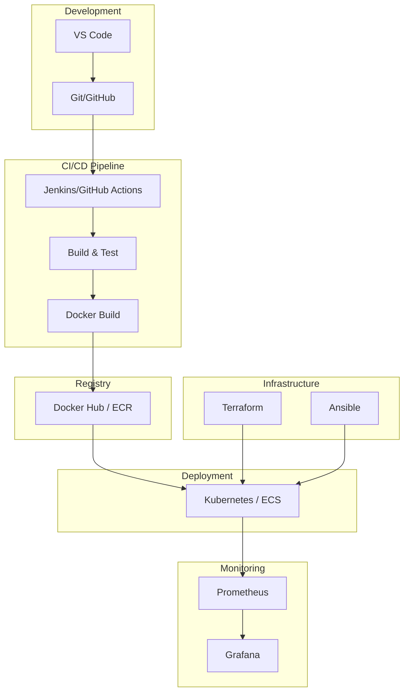

# 🚀 DevOps Fundamentals — Complete Revision Guide

> **DevOps = Culture + Automation + Measurement + Sharing (CAMS)**

---

## 📖 What is DevOps?

DevOps is a **cultural and technical movement** that bridges the gap between **Development (Dev)** and **Operations (Ops)** teams. It emphasizes collaboration, automation, continuous integration, continuous delivery, and monitoring to deliver software **faster, more reliably, and at scale**.

### Key Definition

> DevOps is a set of practices, tools, and a cultural philosophy that automates and integrates the processes between software development and IT operations teams.

### Why DevOps Was Needed

| Traditional Approach | DevOps Approach |
|---------------------|-----------------|
| Dev and Ops work in silos | Dev and Ops collaborate |
| Manual deployments | Automated deployments |
| Releases every few months | Releases multiple times/day |
| Blame culture | Shared responsibility |
| Slow feedback loops | Fast feedback loops |
| Reactive monitoring | Proactive monitoring |

---

## 🏗️ Software Development Life Cycle (SDLC)

### What is SDLC?

SDLC is a structured process used for developing software applications. It defines the stages involved from planning to deployment and maintenance.

### SDLC Models

| Model | Description | When to Use |
|-------|-------------|-------------|
| **Waterfall** | Linear, sequential phases | Requirements are clear and fixed |
| **Agile** | Iterative, incremental delivery | Requirements change frequently |
| **Spiral** | Risk-driven, iterative | Large, complex projects |
| **V-Model** | Verification & Validation | Safety-critical systems |
| **DevOps** | Continuous delivery & feedback | Modern software development |

### Waterfall vs Agile vs DevOps

```
Waterfall:   Plan → Design → Build → Test → Deploy → Maintain (One-time linear)

Agile:       [Sprint 1] → [Sprint 2] → [Sprint 3] → ... (Iterative cycles)

DevOps:      Plan → Code → Build → Test → Release → Deploy → Operate → Monitor
             ↑                                                                ↓
             └────────────────── Continuous Feedback ──────────────────────────┘
```

---

## 🔄 DevOps Lifecycle (8 Phases)



### Phase Details

| # | Phase | Description | Tools |
|---|-------|-------------|-------|
| 1 | **Plan** | Define requirements, create user stories | Jira, Trello, Azure Boards |
| 2 | **Code** | Write application code | VS Code, Git, GitHub |
| 3 | **Build** | Compile code, create artifacts | Maven, Gradle, npm |
| 4 | **Test** | Automated testing (unit, integration, e2e) | Selenium, JUnit, Jest |
| 5 | **Release** | Version and package the software | GitHub Releases, Nexus |
| 6 | **Deploy** | Deploy to production/staging | Kubernetes, Docker, AWS |
| 7 | **Operate** | Manage infrastructure and apps | Terraform, Ansible, Puppet |
| 8 | **Monitor** | Track performance, logs, alerts | Prometheus, Grafana, ELK |

---

## 🔁 CI/CD — Continuous Integration & Continuous Delivery/Deployment

### What is CI (Continuous Integration)?

CI is the practice of **automatically building and testing code** every time a developer pushes changes to the repository.

```
Developer pushes code → Automated Build → Automated Tests → Feedback
```

**Key Practices:**
- Developers commit code frequently (multiple times/day)
- Every commit triggers an automated build
- Automated tests run on every build
- Fast feedback on build failures

### What is CD (Continuous Delivery)?

CD ensures that code is **always in a deployable state**. After passing CI, the code is automatically prepared for release but requires **manual approval** for production deployment.

### What is CD (Continuous Deployment)?

Continuous Deployment goes one step further — every change that passes all tests is **automatically deployed to production** without manual intervention.

### CI vs CD Comparison

```
CI:                    Code → Build → Test ✅

Continuous Delivery:   Code → Build → Test → Ready for Release (Manual Deploy) ✅

Continuous Deployment: Code → Build → Test → Auto Deploy to Production ✅
```

### CI/CD Pipeline Example



---

## 🛠️ DevOps Tools Ecosystem

### Complete Tools Map

| Category | Tools |
|----------|-------|
| **Version Control** | Git, GitHub, GitLab, Bitbucket |
| **CI/CD** | Jenkins, GitHub Actions, GitLab CI, CircleCI, Travis CI, Azure DevOps |
| **Containerization** | Docker, Podman, containerd |
| **Container Orchestration** | Kubernetes, Docker Swarm, Amazon ECS |
| **Infrastructure as Code** | Terraform, Pulumi, CloudFormation |
| **Configuration Management** | Ansible, Puppet, Chef, SaltStack |
| **Cloud Providers** | AWS, Azure, GCP, DigitalOcean |
| **Monitoring & Logging** | Prometheus, Grafana, ELK Stack, Datadog, Splunk |
| **Artifact Repository** | JFrog Artifactory, Nexus, Docker Hub |
| **Security (DevSecOps)** | Snyk, Trivy, SonarQube, OWASP ZAP |
| **Collaboration** | Slack, Microsoft Teams, Jira, Confluence |

### Tools Architecture Diagram



---

## 🏛️ DevOps Principles & Culture

### The Three Ways of DevOps

| Way | Principle | Description |
|-----|-----------|-------------|
| **1st Way** | Flow | Accelerate the flow of work from Dev to Ops to Customer |
| **2nd Way** | Feedback | Enable fast and constant feedback from right to left |
| **3rd Way** | Continuous Learning | Foster a culture of experimentation and learning |

### DevOps Practices

1. **Infrastructure as Code (IaC)** — Manage infrastructure using code (Terraform, Ansible)
2. **Configuration Management** — Automate server configuration (Ansible, Puppet)
3. **Continuous Monitoring** — Monitor applications and infrastructure 24/7
4. **Microservices** — Break applications into small, independent services
5. **Communication & Collaboration** — Break silos between teams
6. **Automation** — Automate everything that can be automated
7. **Version Control** — Everything in Git (code, configs, infra)

---

## 🆚 DevOps vs SRE vs Platform Engineering

| Aspect | DevOps | SRE | Platform Engineering |
|--------|--------|-----|---------------------|
| **Focus** | Culture & collaboration | Reliability & uptime | Developer experience |
| **Origin** | Industry movement | Google | Evolution of DevOps |
| **Key Metric** | Deployment frequency | SLI/SLO/SLA | Developer productivity |
| **Approach** | Broad practices | Engineering approach to ops | Self-service platforms |
| **Error Budget** | Not formal | Core concept | Inherited from SRE |
| **Tools** | CI/CD, IaC | Monitoring, alerting | Internal platforms |

---

## 📊 DevOps Metrics (DORA Metrics)

| Metric | Description | Elite Performance |
|--------|-------------|-------------------|
| **Deployment Frequency** | How often you deploy | Multiple times/day |
| **Lead Time for Changes** | Time from commit to production | Less than 1 hour |
| **Change Failure Rate** | % of deployments causing failures | 0-15% |
| **Mean Time to Recovery (MTTR)** | Time to recover from failure | Less than 1 hour |

---

## ⚡ Quick Reference Cheat Sheet

```
DevOps       = Development + Operations
CI           = Continuous Integration (auto build + test)
CD           = Continuous Delivery (auto release-ready)
CD           = Continuous Deployment (auto deploy to production)
IaC          = Infrastructure as Code (Terraform)
CM           = Configuration Management (Ansible)
SRE          = Site Reliability Engineering
DORA         = DevOps Research and Assessment
MTTR         = Mean Time to Recovery
MTTF         = Mean Time to Failure
SLA          = Service Level Agreement
SLO          = Service Level Objective
SLI          = Service Level Indicator
```

---

## 🎯 Interview Questions & Answers

### Q1: What is DevOps?
**A:** DevOps is a cultural and technical practice that combines software Development and IT Operations. It aims to shorten the development lifecycle and deliver high-quality software continuously through automation, collaboration, and monitoring.

### Q2: What are the benefits of DevOps?
**A:**
- Faster delivery of features
- More stable operating environments
- Improved communication and collaboration
- More time for innovation (less time fixing)
- Reduced deployment failures
- Faster mean time to recovery

### Q3: What is the difference between Agile and DevOps?
**A:**
| Agile | DevOps |
|-------|--------|
| Focuses on development process | Focuses on development + operations |
| Iterative development in sprints | Continuous integration and deployment |
| Bridges gap between requirements and development | Bridges gap between development and operations |
| Smaller releases in sprints | Continuous releases |
| Feedback from customers | Feedback from monitoring & ops |

### Q4: Explain CI/CD Pipeline
**A:** A CI/CD pipeline automates the software delivery process. **CI** automatically builds and tests code on every commit. **CD** (Delivery) ensures code is always release-ready, while **CD** (Deployment) automatically pushes to production. A typical pipeline: Code Push → Build → Test → Security Scan → Deploy to Staging → Deploy to Production.

### Q5: What is Infrastructure as Code (IaC)?
**A:** IaC is the practice of managing and provisioning infrastructure through machine-readable configuration files rather than physical hardware configuration or interactive tools. Tools like Terraform and CloudFormation let you define infrastructure in code, enabling version control, reproducibility, and automation.

### Q6: What is Configuration Management?
**A:** Configuration Management is the process of automating and standardizing the configuration of servers and infrastructure. Tools like Ansible, Puppet, and Chef ensure all servers are configured consistently and can be reproduced easily.

### Q7: What is the difference between Continuous Delivery and Continuous Deployment?
**A:**
- **Continuous Delivery**: Code is automatically tested and prepared for release, but deployment to production requires **manual approval**
- **Continuous Deployment**: Every change that passes all tests is **automatically deployed** to production without human intervention

### Q8: What are microservices?
**A:** Microservices is an architectural approach where an application is built as a collection of small, independent services. Each service runs in its own process, communicates via APIs, and can be deployed independently. Benefits include scalability, fault isolation, and technology flexibility.

### Q9: Name some popular DevOps tools and their purposes
**A:**
| Tool | Purpose |
|------|---------|
| Git | Version Control |
| Jenkins | CI/CD Automation |
| Docker | Containerization |
| Kubernetes | Container Orchestration |
| Terraform | Infrastructure as Code |
| Ansible | Configuration Management |
| Prometheus | Monitoring |
| Grafana | Visualization/Dashboards |

### Q10: What is a DevOps pipeline?
**A:** A DevOps pipeline is an automated set of processes that allow developers and operations teams to reliably and efficiently build, test, and deploy code. It typically includes stages: Source → Build → Test → Deploy → Monitor.

### Q11: What is the role of automation in DevOps?
**A:** Automation is the backbone of DevOps. It reduces manual errors, speeds up processes, ensures consistency, and enables teams to focus on innovation. Areas automated include: build, testing, deployment, infrastructure provisioning, monitoring, and incident response.

### Q12: What is Shift-Left in DevOps?
**A:** Shift-Left means moving testing, quality, and security earlier in the development lifecycle. Instead of finding bugs after deployment, teams identify issues during development. This includes early code reviews, automated testing in CI, and security scanning before deployment.

### Q13: What are the key DevOps metrics (DORA)?
**A:** The four DORA metrics are:
1. **Deployment Frequency** — How often you deploy to production
2. **Lead Time for Changes** — Time from commit to production
3. **Change Failure Rate** — Percentage of deployments causing failures
4. **MTTR** — Mean Time to Recovery from failures

### Q14: What is the difference between DevOps and SRE?
**A:** DevOps is a broad cultural movement focusing on collaboration between Dev and Ops. SRE (Site Reliability Engineering), created by Google, is a specific implementation of DevOps principles using software engineering to solve operations problems. SRE uses concepts like error budgets, SLIs, SLOs, and SLAs.

### Q15: What is Version Control and why is it important?
**A:** Version Control (like Git) tracks changes to code over time, allowing multiple developers to collaborate, roll back to previous versions, and maintain a history of changes. It's essential for DevOps because it enables CI/CD, code reviews, and infrastructure as code.

### Q16: What is a monolithic vs microservices architecture?
**A:**
| Monolithic | Microservices |
|-----------|---------------|
| Single codebase | Multiple independent services |
| Single deployment | Independent deployments |
| Tightly coupled | Loosely coupled |
| Scales as a whole | Each service scales independently |
| Simple initially | Complex but flexible |
| Single point of failure | Fault isolation |

### Q17: What is Blue-Green Deployment?
**A:** Blue-Green deployment is a strategy where you maintain two identical production environments (Blue and Green). At any time, one serves live traffic. When deploying a new version, you deploy to the idle environment, test it, then switch traffic. This enables zero-downtime deployments and easy rollbacks.

### Q18: What is Canary Deployment?
**A:** Canary deployment is a strategy where you gradually roll out changes to a small subset of users (say 5%) before rolling it out to the entire infrastructure. If the canary performs well, you progressively increase the rollout percentage. This reduces the risk of deploying to all users at once.

### Q19: What is GitOps?
**A:** GitOps is a modern approach where Git is used as the single source of truth for both application code and infrastructure. Changes are made through pull requests, and automated tools (like ArgoCD, Flux) ensure the deployed state matches the desired state defined in Git.

### Q20: What is DevSecOps?
**A:** DevSecOps integrates security into every phase of the DevOps lifecycle rather than treating it as an afterthought. It includes automated security testing, vulnerability scanning, compliance checks, and security-as-code practices throughout the CI/CD pipeline.

---

## 💡 Key Takeaways

```
✅ DevOps is a CULTURE, not just tools
✅ Automation is the backbone of DevOps
✅ CI/CD enables faster, reliable software delivery
✅ Monitoring and feedback loops are essential
✅ Infrastructure should be treated as code
✅ Security should be shifted left (DevSecOps)
✅ Measure success with DORA metrics
✅ Continuous learning and improvement is key
```

---

> 🚀 *"DevOps is not a goal, but a never-ending process of continual improvement."* — Jez Humble