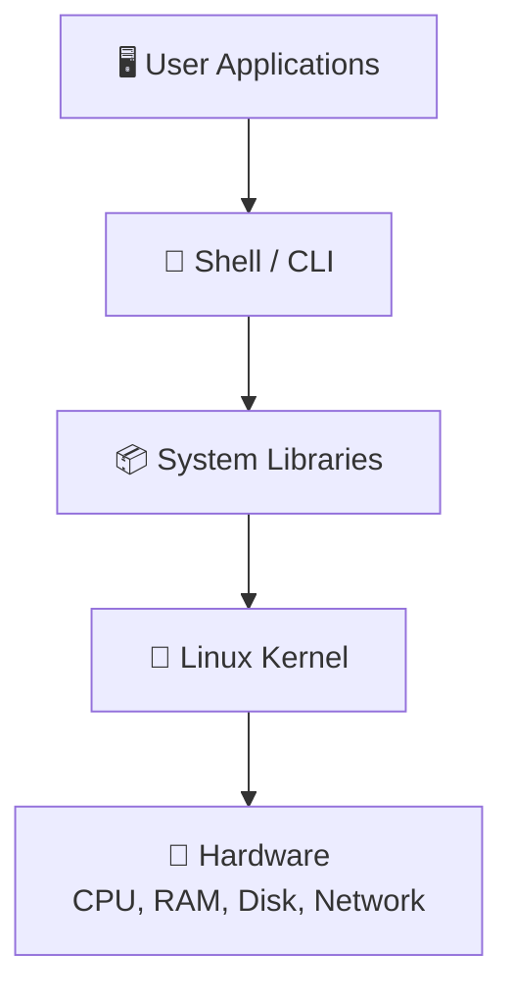

# 🐧 Linux — Complete Revision Guide

> **Linux is the foundation of DevOps. Master Linux = Master DevOps.**

---

## 📖 What is Linux?

Linux is a **free, open-source operating system** based on Unix. It was created by **Linus Torvalds** in 1991. Linux is the most widely used OS for servers, cloud infrastructure, containers, and DevOps environments.

### Why Linux in DevOps?

- 🖥️ **90%+ of servers** run Linux
- ☁️ **All major cloud providers** use Linux (AWS, Azure, GCP)
- 🐳 **Docker & Kubernetes** run natively on Linux
- 💸 **Free and open-source** — no licensing costs
- 🔒 **Secure and stable** — preferred for production environments
- 🛠️ **Automation-friendly** — powerful CLI & scripting capabilities

---

## 🏗️ Linux Architecture



| Layer | Description |
|-------|-------------|
| **Hardware** | Physical resources (CPU, RAM, Disk, NIC) |
| **Kernel** | Core of OS — manages hardware, memory, processes, file systems |
| **Shell** | Interface between user and kernel (Bash, Zsh, Fish) |
| **Applications** | User-level programs (Nginx, Docker, Git) |

---

## 📁 Linux File System Hierarchy

```
/                   → Root directory (everything starts here)
├── /bin            → Essential user binaries (ls, cp, mv, cat)
├── /sbin           → System binaries (reboot, fdisk, iptables)
├── /etc            → Configuration files (nginx.conf, passwd, hosts)
├── /home           → User home directories (/home/shahe)
├── /root           → Root user's home directory
├── /var            → Variable data (logs, databases, mail)
│   ├── /var/log    → System and application logs
│   └── /var/www    → Web server files
├── /tmp            → Temporary files (cleared on reboot)
├── /usr            → User programs and libraries
│   ├── /usr/bin    → User binaries
│   └── /usr/lib    → Libraries
├── /opt            → Optional/third-party software
├── /dev            → Device files (sda, tty, null)
├── /proc           → Process and kernel information (virtual filesystem)
├── /sys            → System hardware info (virtual filesystem)
├── /boot           → Boot loader files (kernel, grub)
└── /mnt, /media    → Mount points for external devices
```

---

## 📋 Essential Linux Commands

### 1️⃣ Navigation & File Management

| Command | Description | Example |
|---------|-------------|---------|
| `pwd` | Print working directory | `pwd` → `/home/shahe` |
| `ls` | List files & directories | `ls -la` (detailed + hidden) |
| `cd` | Change directory | `cd /var/log` |
| `mkdir` | Create directory | `mkdir -p project/src` (-p creates parents) |
| `rmdir` | Remove empty directory | `rmdir old_folder` |
| `touch` | Create empty file | `touch index.html` |
| `cp` | Copy files/directories | `cp -r source/ dest/` (-r recursive) |
| `mv` | Move or rename | `mv old.txt new.txt` |
| `rm` | Remove files/directories | `rm -rf folder/` (-r recursive, -f force) |
| `find` | Search for files | `find / -name "*.log"` |
| `locate` | Quick file search (indexed) | `locate nginx.conf` |
| `tree` | Display directory tree | `tree -L 2` (2 levels deep) |

### 2️⃣ File Viewing & Editing

| Command | Description | Example |
|---------|-------------|---------|
| `cat` | Display file contents | `cat /etc/hosts` |
| `less` | View file page by page | `less /var/log/syslog` |
| `more` | View file (forward only) | `more largefile.txt` |
| `head` | Show first N lines | `head -20 file.txt` |
| `tail` | Show last N lines | `tail -f /var/log/syslog` (-f follow) |
| `nano` | Simple text editor | `nano config.yml` |
| `vim` | Advanced text editor | `vim app.js` |
| `wc` | Word/line/char count | `wc -l file.txt` (line count) |
| `grep` | Search text patterns | `grep -i "error" /var/log/syslog` |
| `awk` | Text processing | `awk '{print $1}' file.txt` |
| `sed` | Stream editor | `sed 's/old/new/g' file.txt` |
| `sort` | Sort file contents | `sort -n numbers.txt` |
| `uniq` | Remove duplicates | `sort file.txt \| uniq` |
| `diff` | Compare files | `diff file1.txt file2.txt` |

### 3️⃣ File Permissions & Ownership

#### Understanding Permission Notation

```
-rwxr-xr-- 1 shahe devops 4096 Jun 05 2026 script.sh
│├─┤├─┤├─┤
│ │   │  │
│ │   │  └── Others: read only (r--)
│ │   └───── Group: read + execute (r-x)
│ └───────── Owner: read + write + execute (rwx)
└─────────── File type: - (file), d (directory), l (link)
```

#### Numeric Permissions

| Number | Permission | Symbol |
|--------|-----------|--------|
| 0 | No permission | `---` |
| 1 | Execute | `--x` |
| 2 | Write | `-w-` |
| 3 | Write + Execute | `-wx` |
| 4 | Read | `r--` |
| 5 | Read + Execute | `r-x` |
| 6 | Read + Write | `rw-` |
| 7 | Read + Write + Execute | `rwx` |

#### Common Permission Patterns

| Numeric | Symbolic | Meaning | Use Case |
|---------|----------|---------|----------|
| `755` | `rwxr-xr-x` | Owner: full, Others: read+exec | Scripts, directories |
| `644` | `rw-r--r--` | Owner: read+write, Others: read | Config files |
| `700` | `rwx------` | Owner only: full access | Private scripts |
| `600` | `rw-------` | Owner only: read+write | SSH keys, secrets |
| `777` | `rwxrwxrwx` | Everyone: full access | ⚠️ NEVER use in production |

#### Permission Commands

```bash
# Change permissions
chmod 755 script.sh            # Numeric
chmod u+x script.sh            # Add execute for user
chmod g-w file.txt             # Remove write for group
chmod -R 644 /var/www/         # Recursive

# Change ownership
chown shahe file.txt           # Change owner
chown shahe:devops file.txt    # Change owner and group
chown -R www-data:www-data /var/www/  # Recursive
```

### 4️⃣ User & Group Management

```bash
# User Management
useradd devuser                # Create user
useradd -m -s /bin/bash devuser  # Create with home dir + shell
passwd devuser                 # Set password
usermod -aG docker devuser     # Add user to group
userdel -r devuser             # Delete user + home directory
id devuser                     # Show user ID and groups
whoami                         # Current user
who                            # Who is logged in
last                           # Login history

# Group Management
groupadd devops                # Create group
groupdel devops                # Delete group
groups devuser                 # Show user's groups
gpasswd -a devuser docker      # Add user to group
gpasswd -d devuser docker      # Remove user from group

# Important Files
cat /etc/passwd                # User accounts
cat /etc/shadow                # Encrypted passwords
cat /etc/group                 # Group information
```

### 5️⃣ Process Management

```bash
# View Processes
ps                             # Current terminal processes
ps aux                         # All processes (detailed)
ps -ef                         # All processes (full format)
top                            # Real-time process monitor
htop                           # Interactive process monitor (better UI)
pgrep nginx                    # Find process ID by name

# Control Processes
kill PID                       # Send SIGTERM (graceful stop)
kill -9 PID                    # Send SIGKILL (force stop)
killall nginx                  # Kill all processes by name
pkill -f "node app.js"         # Kill by pattern match

# Background/Foreground
command &                      # Run in background
jobs                           # List background jobs
fg %1                          # Bring job 1 to foreground
bg %1                          # Resume job 1 in background
nohup command &                # Run even after logout

# Process Info
pidof nginx                    # Get PID of process
lsof -i :80                   # What process uses port 80
```

### 6️⃣ Package Management

| Distribution | Package Manager | Commands |
|-------------|----------------|----------|
| **Ubuntu/Debian** | APT | `apt update`, `apt install`, `apt remove` |
| **CentOS/RHEL** | YUM/DNF | `yum install`, `dnf install` |
| **Alpine** | APK | `apk add`, `apk del` |

```bash
# APT (Ubuntu/Debian)
sudo apt update                # Update package list
sudo apt upgrade               # Upgrade all packages
sudo apt install nginx         # Install package
sudo apt remove nginx          # Remove package
sudo apt autoremove            # Remove unused packages
apt list --installed           # List installed packages
apt search docker              # Search for packages

# YUM/DNF (CentOS/RHEL)
sudo yum update                # Update packages
sudo yum install httpd         # Install package
sudo dnf install nginx         # DNF (newer)
sudo yum remove httpd          # Remove package
yum list installed             # List installed
```

### 7️⃣ Service Management (systemctl)

```bash
# Service Control
sudo systemctl start nginx     # Start service
sudo systemctl stop nginx      # Stop service
sudo systemctl restart nginx   # Restart service
sudo systemctl reload nginx    # Reload config (no restart)
sudo systemctl status nginx    # Check status

# Enable/Disable on Boot
sudo systemctl enable nginx    # Start on boot
sudo systemctl disable nginx   # Don't start on boot
sudo systemctl is-active nginx # Check if running
sudo systemctl is-enabled nginx # Check if enabled

# List Services
systemctl list-units --type=service           # All active services
systemctl list-units --type=service --all     # All services
systemctl list-unit-files --type=service      # All service files

# Logs (journalctl)
journalctl -u nginx            # Logs for nginx
journalctl -u nginx -f         # Follow logs (live)
journalctl -u nginx --since "1 hour ago"     # Recent logs
journalctl -u nginx --no-pager # Without paging
```

### 8️⃣ Disk & Storage Management

```bash
# Disk Usage
df -h                          # Disk space (human readable)
df -hT                         # With filesystem type
du -sh /var/log/               # Directory size
du -h --max-depth=1 /          # Top-level directory sizes
lsblk                          # List block devices
fdisk -l                       # List partitions

# Disk Mounting
mount /dev/sdb1 /mnt/data      # Mount device
umount /mnt/data               # Unmount device
cat /etc/fstab                 # Persistent mounts

# Disk Cleanup
sudo apt autoremove            # Remove unused packages
sudo journalctl --vacuum-time=3d  # Clean old logs
docker system prune            # Clean Docker resources
```

### 9️⃣ Network Commands

```bash
# Network Info
ip a                           # Show IP addresses
ip addr show                   # Same as above
hostname -I                    # Show machine IP
ifconfig                       # Network interfaces (legacy)

# Connectivity
ping google.com                # Test connectivity
ping -c 4 8.8.8.8             # Ping 4 times
traceroute google.com          # Trace packet route
curl http://localhost           # HTTP request
wget https://example.com/file  # Download file

# DNS
nslookup google.com            # DNS lookup
dig google.com                 # Detailed DNS info
cat /etc/resolv.conf           # DNS configuration
cat /etc/hosts                 # Local DNS entries

# Ports & Connections
ss -tulnp                      # Show active ports
netstat -tulnp                 # Show ports (legacy)
lsof -i :80                   # What's using port 80
```

### 🔟 SSH (Secure Shell)

```bash
# Connect to Remote Server
ssh user@192.168.1.100         # Basic connection
ssh -p 2222 user@hostname      # Custom port
ssh -i key.pem ec2-user@ip     # With private key (AWS)

# SSH Key Management
ssh-keygen -t rsa -b 4096     # Generate SSH key pair
ssh-copy-id user@server        # Copy public key to server
cat ~/.ssh/id_rsa.pub          # View public key
cat ~/.ssh/authorized_keys     # Authorized keys on server

# SCP (Secure Copy)
scp file.txt user@server:/path/          # Copy to remote
scp user@server:/path/file.txt ./        # Copy from remote
scp -r folder/ user@server:/path/        # Copy directory

# SSH Config (~/.ssh/config)
# Host myserver
#     HostName 192.168.1.100
#     User shahe
#     Port 22
#     IdentityFile ~/.ssh/id_rsa
```

---

## ⏰ Cron Jobs (Task Scheduling)

### Cron Syntax

```
* * * * * command_to_execute
│ │ │ │ │
│ │ │ │ └── Day of Week (0-7, Sun=0 or 7)
│ │ │ └──── Month (1-12)
│ │ └────── Day of Month (1-31)
│ └──────── Hour (0-23)
└────────── Minute (0-59)
```

### Common Cron Examples

| Schedule | Cron Expression | Description |
|----------|----------------|-------------|
| Every minute | `* * * * *` | Runs every minute |
| Every hour | `0 * * * *` | At minute 0 of every hour |
| Every day at midnight | `0 0 * * *` | At 00:00 daily |
| Every Monday at 9 AM | `0 9 * * 1` | Monday morning |
| Every 5 minutes | `*/5 * * * *` | Every 5 minutes |
| Twice a day | `0 9,18 * * *` | At 9 AM and 6 PM |

### Cron Commands

```bash
crontab -e                     # Edit crontab
crontab -l                     # List cron jobs
crontab -r                     # Remove all cron jobs
sudo crontab -u shahe -l       # List user's cron jobs
```

---

## 📦 Compression & Archives

```bash
# TAR
tar -cvf archive.tar folder/          # Create archive
tar -xvf archive.tar                   # Extract archive
tar -czvf archive.tar.gz folder/       # Create compressed (gzip)
tar -xzvf archive.tar.gz               # Extract compressed
tar -tf archive.tar                    # List contents

# ZIP
zip -r archive.zip folder/            # Create zip
unzip archive.zip                      # Extract zip
unzip -l archive.zip                   # List contents
```

---

## 🔗 Links (Soft Link vs Hard Link)

| Feature | Soft Link (Symbolic) | Hard Link |
|---------|---------------------|-----------|
| **Command** | `ln -s target link` | `ln target link` |
| **Cross filesystem** | ✅ Yes | ❌ No |
| **Link to directories** | ✅ Yes | ❌ No |
| **Original deleted** | ❌ Link breaks | ✅ Data still accessible |
| **Inode** | Different inode | Same inode |
| **Use case** | Shortcuts, configs | Backup, same-disk references |

```bash
# Create soft link
ln -s /var/log/nginx/access.log ~/nginx-log

# Create hard link
ln important-file.txt backup-file.txt

# Verify links
ls -li                         # Show inodes
readlink symlink               # Show link target
```

---

## 📊 System Monitoring Commands

```bash
# System Info
uname -a                       # System information
hostname                       # Machine hostname
uptime                         # System uptime
cat /etc/os-release            # OS version

# Resource Monitoring
top                            # Real-time CPU/memory
htop                           # Interactive monitor
free -h                        # Memory usage
df -h                          # Disk space
iostat                         # CPU and I/O stats
vmstat                         # Virtual memory stats
sar                            # System activity report

# Log Files
tail -f /var/log/syslog        # System logs (live)
tail -f /var/log/auth.log      # Authentication logs
cat /var/log/nginx/access.log  # Nginx access log
cat /var/log/nginx/error.log   # Nginx error log
dmesg                          # Kernel messages
```

---

## ⚡ Quick Reference Cheat Sheet

| Task | Command |
|------|---------|
| Show current directory | `pwd` |
| List all files (hidden too) | `ls -la` |
| Create nested directories | `mkdir -p a/b/c` |
| Find files by name | `find / -name "*.conf"` |
| Search text in files | `grep -ri "error" /var/log/` |
| Check disk space | `df -h` |
| Check memory | `free -h` |
| Check running processes | `ps aux` |
| Check ports in use | `ss -tulnp` |
| Follow live logs | `tail -f /var/log/syslog` |
| Check service status | `systemctl status nginx` |
| Change permissions | `chmod 755 script.sh` |
| Change ownership | `chown user:group file` |
| Transfer files via SSH | `scp file user@host:/path/` |
| Schedule a task | `crontab -e` |

---

## 🎯 Interview Questions & Answers

### Q1: What is the Linux Kernel?
**A:** The kernel is the core of the Linux OS. It manages system resources including CPU, memory, devices, and processes. It acts as a bridge between hardware and software applications.

### Q2: What is the difference between Soft Link and Hard Link?
**A:**
- **Soft link** (`ln -s`): A pointer/shortcut to another file. Has a different inode. Breaks if the original is deleted. Can cross filesystems and link to directories.
- **Hard link** (`ln`): Another name for the same file data. Same inode. Data remains accessible even if the original is deleted. Cannot cross filesystems or link to directories.

### Q3: What does `chmod 755` mean?
**A:** `chmod 755` sets permissions:
- **Owner (7)**: Read + Write + Execute (rwx)
- **Group (5)**: Read + Execute (r-x)
- **Others (5)**: Read + Execute (r-x)
This is commonly used for executable scripts and directories.

### Q4: What is the difference between `ps` and `top`?
**A:**
- `ps`: Shows a **snapshot** of current processes at a point in time
- `top`: Shows a **real-time, continuously updating** view of processes, CPU, and memory usage

### Q5: How do you find which process is using a specific port?
**A:**
```bash
ss -tulnp | grep :80     # Modern way
netstat -tulnp | grep :80 # Legacy way
lsof -i :80              # Using lsof
```

### Q6: What is the `/etc/passwd` file?
**A:** It contains user account information. Each line represents one user with fields:
```
username:x:UID:GID:comment:home_directory:shell
shahe:x:1000:1000:Shahe Alam:/home/shahe:/bin/bash
```
The `x` means the password is stored in `/etc/shadow`.

### Q7: What is the difference between `apt` and `yum`?
**A:**
| Feature | APT | YUM |
|---------|-----|-----|
| Distribution | Ubuntu/Debian | CentOS/RHEL |
| Package format | `.deb` | `.rpm` |
| Config | `/etc/apt/sources.list` | `/etc/yum.repos.d/` |
| Update | `apt update` | `yum update` |

### Q8: How do you check system memory usage?
**A:**
```bash
free -h         # Quick summary (total, used, free, available)
top             # Real-time with per-process breakdown
cat /proc/meminfo  # Detailed memory information
```

### Q9: What is `systemctl` and how does it differ from `service`?
**A:** Both manage services, but:
- `systemctl` is the modern tool (systemd-based) — used in Ubuntu 16+, CentOS 7+
- `service` is the legacy tool (SysVinit-based)
- `systemctl` supports enable/disable on boot, better logging, and dependency management

### Q10: What is the purpose of `/var/log`?
**A:** It stores system and application log files:
- `/var/log/syslog` — General system logs
- `/var/log/auth.log` — Authentication/login logs
- `/var/log/nginx/` — Nginx web server logs
- `/var/log/kern.log` — Kernel messages
- `/var/log/dmesg` — Boot messages

### Q11: How do you schedule a task to run every day at midnight?
**A:** Using crontab:
```bash
crontab -e
# Add this line:
0 0 * * * /path/to/script.sh
```
Format: `minute hour day_of_month month day_of_week command`

### Q12: What is the `grep` command?
**A:** `grep` searches for text patterns in files.
```bash
grep "error" log.txt           # Search for "error"
grep -i "error" log.txt        # Case-insensitive
grep -r "TODO" ./project/      # Recursive search
grep -c "error" log.txt        # Count matches
grep -n "error" log.txt        # Show line numbers
grep -v "info" log.txt         # Invert match (exclude "info")
```

### Q13: What is SSH and how does it work?
**A:** SSH (Secure Shell) is a protocol for securely connecting to remote servers. It uses **public-key cryptography** for authentication:
1. Client generates a key pair (public + private)
2. Public key is placed on the server (`~/.ssh/authorized_keys`)
3. Client authenticates using the private key
Default port: **22**

### Q14: How do you check which ports are open on a Linux server?
**A:**
```bash
ss -tulnp          # Show all listening TCP/UDP ports with process info
netstat -tulnp     # Same (legacy)
nmap localhost     # Port scanning
```

### Q15: What is the difference between `kill` and `kill -9`?
**A:**
- `kill PID` → Sends **SIGTERM (15)** — requests graceful shutdown, process can clean up
- `kill -9 PID` → Sends **SIGKILL (9)** — forces immediate termination, no cleanup

### Q16: What is an inode in Linux?
**A:** An inode is a data structure that stores metadata about a file (permissions, owner, size, timestamps, disk block locations) but **NOT the filename**. Each file has a unique inode number. Hard links share the same inode.

### Q17: What is the `/proc` filesystem?
**A:** `/proc` is a **virtual filesystem** that provides information about running processes and system information. It doesn't exist on disk — it's generated by the kernel in real-time.
- `/proc/cpuinfo` — CPU information
- `/proc/meminfo` — Memory information
- `/proc/PID/` — Process information

### Q18: How do you make a script executable?
**A:**
```bash
chmod +x script.sh    # Add execute permission
./script.sh           # Run the script
```
The script should start with a shebang line: `#!/bin/bash`

### Q19: What is piping and redirection?
**A:**
- **Pipe (`|`)**: Sends output of one command as input to another
  ```bash
  ps aux | grep nginx
  cat file.txt | sort | uniq
  ```
- **Redirection**: Sends output to a file
  ```bash
  echo "hello" > file.txt    # Overwrite
  echo "world" >> file.txt   # Append
  command 2> error.log       # Redirect errors
  command &> all.log         # Redirect all output
  ```

### Q20: What are environment variables?
**A:** Variables available to all processes in a session.
```bash
echo $PATH               # View PATH variable
echo $HOME               # Home directory
export MY_VAR="value"    # Set variable
printenv                 # Show all env variables
env                      # Same as printenv
# Permanent: Add to ~/.bashrc or /etc/environment
```

### Q21: What is `sudo`?
**A:** `sudo` (Super User Do) allows a permitted user to run commands as the **root (superuser)**. It provides temporary elevated privileges. Configuration is in `/etc/sudoers` file (edited with `visudo`).

### Q22: How do you check system uptime and load average?
**A:**
```bash
uptime
# Output: 10:30:24 up 45 days, 2:30, 2 users, load average: 0.15, 0.10, 0.05
# Load average: 1min, 5min, 15min
# Load < Number of CPUs = healthy
```

---

## 💡 Linux Best Practices for DevOps

```
✅ Never work as root — use sudo
✅ Use SSH keys instead of passwords
✅ Set proper file permissions (never 777 in production)
✅ Monitor logs regularly
✅ Keep system packages updated
✅ Use cron for automation
✅ Backup important files and configs
✅ Use systemctl for service management
✅ Document your server configurations
✅ Use version control for config files
```

---

> 🚀 *"In the world of DevOps, Linux is not optional — it's essential."*