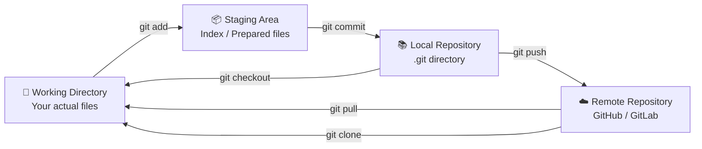
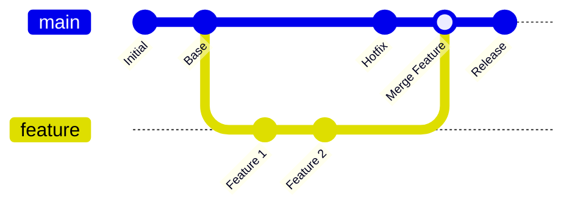
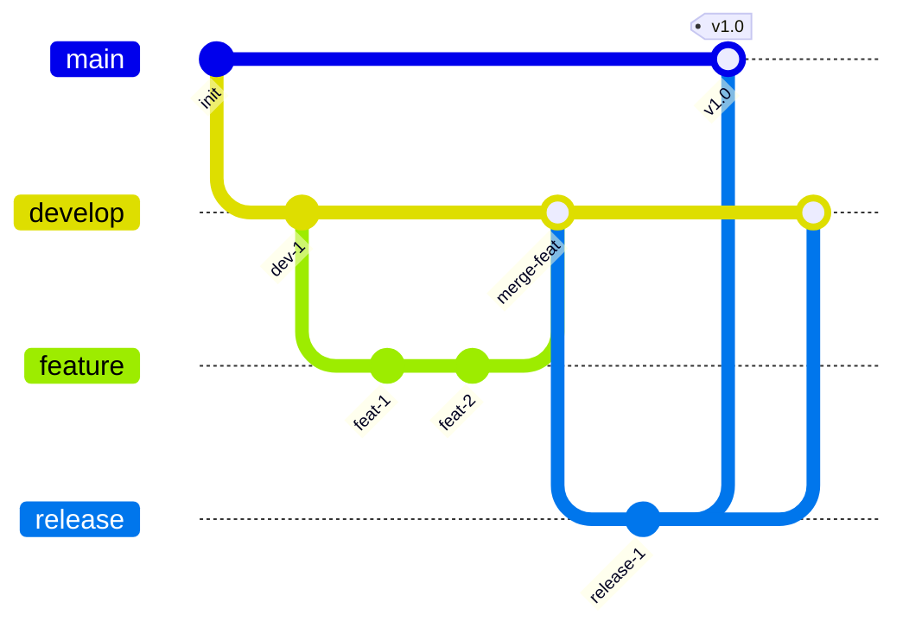
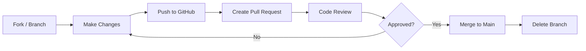

# 🔧 Git & GitHub — Complete Revision Guide

> **Git = Version Control | GitHub = Collaboration Platform**

---

## 📖 What is Git?

Git is a **free, open-source Distributed Version Control System (DVCS)** created by **Linus Torvalds** in 2005. It tracks changes in source code, allows multiple developers to collaborate, and maintains a complete history of every modification.

### What is GitHub?

GitHub is a **cloud-based hosting platform** for Git repositories. It adds features like Pull Requests, Issues, Actions (CI/CD), Wikis, and collaboration tools on top of Git.

### Git vs GitHub

| Feature | Git | GitHub |
|---------|-----|--------|
| **Type** | Version control tool | Cloud hosting platform |
| **Where** | Local machine | Cloud (github.com) |
| **Function** | Track code changes | Host, collaborate, share |
| **Created** | 2005 by Linus Torvalds | 2008, acquired by Microsoft |
| **Alternatives** | - | GitLab, Bitbucket, Azure Repos |
| **Works offline** | ✅ Yes | ❌ Needs internet |

---

## 🏗️ Git Architecture

### Three Areas of Git



| Area | Description | Location |
|------|-------------|----------|
| **Working Directory** | Where you edit files | Your project folder |
| **Staging Area (Index)** | Files ready to be committed | `.git/index` |
| **Local Repository** | Committed history on your machine | `.git/` directory |
| **Remote Repository** | Hosted on GitHub/GitLab | Cloud server |

### Git Objects

| Object | Description |
|--------|-------------|
| **Blob** | Stores file content |
| **Tree** | Stores directory structure |
| **Commit** | Snapshot of the project + metadata (author, date, message, parent) |
| **Tag** | Named pointer to a specific commit |

---

## 📋 Git Commands — Complete Reference

### 1️⃣ Setup & Configuration

```bash
# Identity
git config --global user.name "Shahe Alam"
git config --global user.email "shahe@example.com"

# View config
git config --list              # Show all settings
git config user.name           # Show specific setting

# Default branch name
git config --global init.defaultBranch main

# Editor
git config --global core.editor "code --wait"   # VS Code

# Alias (shortcuts)
git config --global alias.st status
git config --global alias.co checkout
git config --global alias.br branch
git config --global alias.cm "commit -m"
```

### 2️⃣ Repository Initialization

```bash
# Create new repository
git init                       # Initialize in current directory
git init project-name          # Initialize in new directory

# Clone existing repository
git clone https://github.com/user/repo.git          # HTTPS
git clone git@github.com:user/repo.git               # SSH
git clone https://github.com/user/repo.git my-folder # Custom directory name
git clone --depth 1 https://github.com/user/repo.git # Shallow clone (latest only)
```

### 3️⃣ Basic Workflow (Add → Commit → Push)

```bash
# Check status
git status                     # Show changed/staged files
git status -s                  # Short format

# Stage changes
git add filename.txt           # Stage specific file
git add .                      # Stage all changes
git add *.js                   # Stage by pattern
git add -A                     # Stage all (including deletions)
git add -p                     # Interactive staging (patch mode)

# Commit
git commit -m "feat: add login feature"         # Commit with message
git commit -am "fix: resolve bug"               # Stage + commit (tracked files only)
git commit --amend -m "Updated message"         # Modify last commit message
git commit --amend --no-edit                    # Add to last commit without changing message

# Push
git push origin main           # Push to remote
git push -u origin main        # Push + set upstream (first time)
git push --force               # Force push ⚠️ (caution!)
git push --force-with-lease    # Safer force push
git push origin --tags         # Push all tags
```

### 4️⃣ Branching & Merging

```bash
# Branch Management
git branch                     # List local branches
git branch -a                  # List all branches (local + remote)
git branch -r                  # List remote branches
git branch feature-login       # Create new branch
git branch -d feature-login    # Delete branch (safe)
git branch -D feature-login    # Delete branch (force)
git branch -m old-name new-name # Rename branch

# Switching Branches
git checkout feature-login     # Switch to branch (legacy)
git checkout -b new-feature    # Create + switch (legacy)
git switch feature-login       # Switch to branch (modern)
git switch -c new-feature      # Create + switch (modern)

# Merging
git merge feature-login        # Merge branch into current
git merge --no-ff feature      # Merge with merge commit
git merge --squash feature     # Squash all commits into one
git merge --abort              # Cancel merge in progress
```

### Merge Workflow



### 5️⃣ Git Stash

```bash
# Save work temporarily
git stash                      # Stash current changes
git stash save "WIP: login"   # Stash with message
git stash -u                   # Include untracked files

# Use stashed changes
git stash list                 # Show all stashes
git stash pop                  # Apply + remove latest stash
git stash apply                # Apply without removing
git stash apply stash@{2}     # Apply specific stash
git stash drop stash@{0}      # Delete specific stash
git stash clear                # Delete all stashes
git stash show -p              # Show stash contents
```

### 6️⃣ Git Log & History

```bash
# View history
git log                        # Full log
git log --oneline              # Compact (one line per commit)
git log --oneline --graph      # Graphical branch view
git log --oneline -5           # Last 5 commits
git log --author="Shahe"       # Filter by author
git log --since="2 weeks ago"  # Filter by date
git log --grep="fix"           # Search commit messages
git log -- filename.txt        # History of specific file
git log -p filename.txt        # With diff for each commit

# Show details
git show commit-hash           # Show specific commit details
git show HEAD                  # Show latest commit
git show HEAD~2                # Show 2 commits before HEAD

# Blame (who wrote each line)
git blame filename.txt         # Show line-by-line authorship
```

### 7️⃣ Git Diff

```bash
git diff                       # Changes in working directory (unstaged)
git diff --staged              # Changes in staging area
git diff HEAD                  # All changes since last commit
git diff branch1 branch2       # Diff between branches
git diff commit1 commit2       # Diff between commits
git diff --stat                # Summary of changes
```

### 8️⃣ Undoing Changes

```bash
# Discard working directory changes
git checkout -- filename.txt   # Restore file (legacy)
git restore filename.txt       # Restore file (modern)

# Unstage files
git reset HEAD filename.txt    # Unstage (legacy)
git restore --staged file.txt  # Unstage (modern)

# Reset commits
git reset --soft HEAD~1        # Undo commit, keep staged
git reset --mixed HEAD~1       # Undo commit, keep working dir (default)
git reset --hard HEAD~1        # Undo commit, discard ALL changes ⚠️

# Revert (safe — creates new commit)
git revert commit-hash         # Create new commit that undoes changes
git revert HEAD                # Revert last commit
```

### Reset vs Revert

| Feature | git reset | git revert |
|---------|-----------|------------|
| **Changes history** | ✅ Yes (rewrites) | ❌ No (creates new commit) |
| **Safe for shared branches** | ❌ No | ✅ Yes |
| **Use case** | Local/private branches | Public/shared branches |
| **Undo method** | Moves HEAD pointer | Creates opposite commit |

### 9️⃣ Git Rebase

```bash
git rebase main                # Rebase current branch onto main
git rebase -i HEAD~3           # Interactive rebase (last 3 commits)
git rebase --abort             # Cancel rebase
git rebase --continue          # Continue after resolving conflicts
```

### Merge vs Rebase

| Feature | Merge | Rebase |
|---------|-------|--------|
| **History** | Preserves all commits + merge commit | Linear, clean history |
| **Extra commits** | Creates merge commit | No extra commits |
| **Safety** | Safe for shared branches | ⚠️ Don't rebase public branches |
| **Use case** | Feature → main | Updating feature with main changes |

```
Merge:
main:    A---B---C---M
              \     /
feature:       D---E

Rebase:
main:    A---B---C
                  \
feature:           D'---E'
```

### 🔟 Cherry-Pick

```bash
git cherry-pick commit-hash    # Apply specific commit to current branch
git cherry-pick --no-commit hash  # Apply without committing
git cherry-pick --abort        # Cancel cherry-pick
```

### Remote Repository Management

```bash
# Remote Commands
git remote -v                  # Show remote URLs
git remote add origin URL      # Add remote
git remote remove origin       # Remove remote
git remote rename origin upstream  # Rename remote
git remote set-url origin NEW_URL  # Change remote URL

# Fetch & Pull
git fetch origin               # Download changes (don't merge)
git fetch --all                # Fetch from all remotes
git pull origin main           # Fetch + merge
git pull --rebase origin main  # Fetch + rebase (cleaner)
```

---

## 🔀 Branching Strategies

### Git Flow



| Branch | Purpose | Merges Into |
|--------|---------|-------------|
| `main` | Production-ready code | — |
| `develop` | Integration branch | `main` (via release) |
| `feature/*` | New features | `develop` |
| `release/*` | Release preparation | `main` + `develop` |
| `hotfix/*` | Emergency production fixes | `main` + `develop` |

### GitHub Flow (Simplified)

```
main → create branch → make changes → pull request → code review → merge → deploy
```

### Trunk-Based Development

```
main → short-lived branches (< 1 day) → merge frequently → deploy from main
```

---

## 🔄 Pull Request (PR) Workflow



### PR Best Practices

- ✅ Write clear, descriptive PR titles
- ✅ Keep PRs small and focused (one feature per PR)
- ✅ Add a detailed description of changes
- ✅ Link related issues
- ✅ Request reviews from relevant team members
- ✅ Resolve all comments before merging
- ✅ Use conventional commit messages

---

## ⚔️ Merge Conflict Resolution

### When Conflicts Happen

Conflicts occur when two branches modify the **same lines** of the **same file**.

### Conflict Markers

```
<<<<<<< HEAD
Your changes (current branch)
=======
Their changes (incoming branch)
>>>>>>> feature-branch
```

### Resolution Steps

```bash
# 1. Attempt merge
git merge feature-branch

# 2. See conflicted files
git status

# 3. Open conflicted file, resolve manually
#    - Remove conflict markers (<<<<, ====, >>>>)
#    - Keep the correct code

# 4. Stage resolved files
git add resolved-file.txt

# 5. Complete the merge
git commit -m "Resolved merge conflicts"
```

---

## 🏷️ Git Tags

```bash
# Create tags
git tag v1.0                   # Lightweight tag
git tag -a v1.0 -m "Release"  # Annotated tag (recommended)
git tag v1.0 commit-hash      # Tag a specific commit

# View tags
git tag                        # List all tags
git show v1.0                  # Show tag details

# Push tags
git push origin v1.0           # Push specific tag
git push origin --tags         # Push all tags

# Delete tags
git tag -d v1.0                # Delete local tag
git push origin --delete v1.0  # Delete remote tag
```

---

## 📄 .gitignore

### Purpose

Tells Git which files/folders to **ignore** (not track).

### Common .gitignore Patterns

```gitignore
# Dependencies
node_modules/
vendor/

# Environment files
.env
.env.local

# Build output
dist/
build/
*.exe
*.dll

# IDE/Editor
.vscode/
.idea/
*.swp

# OS files
.DS_Store
Thumbs.db

# Logs
*.log
logs/

# Docker
docker-compose.override.yml

# Secrets
*.pem
*.key
```

### .gitignore Rules

| Pattern | Meaning |
|---------|---------|
| `*.log` | Ignore all .log files |
| `build/` | Ignore build directory |
| `!important.log` | Don't ignore this specific file |
| `**/temp` | Ignore temp in any directory |
| `doc/*.txt` | Ignore .txt files in doc/ only |

---

## 🔑 GitHub Features

| Feature | Description |
|---------|-------------|
| **Repositories** | Host and manage Git repos |
| **Pull Requests** | Propose, review, and merge changes |
| **Issues** | Track bugs, features, tasks |
| **Actions** | CI/CD automation (build, test, deploy) |
| **Forks** | Copy a repo to your account |
| **Stars** | Bookmark repos you find useful |
| **Wikis** | Documentation for your project |
| **Projects** | Kanban boards for project management |
| **Gists** | Share code snippets |
| **Discussions** | Community Q&A |
| **Releases** | Package and distribute versions |
| **Pages** | Host static websites for free |

---

## ✍️ Conventional Commit Messages

```
<type>(<scope>): <description>

feat:     New feature
fix:      Bug fix
docs:     Documentation only
style:    Code style (formatting, semicolons)
refactor: Code restructuring (no feature/fix)
test:     Adding/updating tests
chore:    Build, CI, tooling changes
perf:     Performance improvement
ci:       CI/CD changes
build:    Build system changes
revert:   Revert a previous commit
```

### Examples

```bash
git commit -m "feat: add user authentication"
git commit -m "fix: resolve login redirect bug"
git commit -m "docs: update API documentation"
git commit -m "refactor: extract helper functions"
git commit -m "chore: update dependencies"
```

---

## ⚡ Quick Reference Cheat Sheet

| Task | Command |
|------|---------|
| Initialize repo | `git init` |
| Clone repo | `git clone URL` |
| Check status | `git status` |
| Stage all | `git add .` |
| Commit | `git commit -m "message"` |
| Push | `git push origin main` |
| Pull latest | `git pull origin main` |
| Create branch | `git branch feature` |
| Switch branch | `git switch feature` |
| Merge branch | `git merge feature` |
| View log | `git log --oneline` |
| Stash changes | `git stash` |
| Apply stash | `git stash pop` |
| Undo last commit | `git reset --soft HEAD~1` |
| Revert commit | `git revert HEAD` |
| View remotes | `git remote -v` |
| Create tag | `git tag -a v1.0 -m "Release"` |

---

## 🎯 Interview Questions & Answers

### Q1: What is Git?
**A:** Git is a free, open-source Distributed Version Control System (DVCS) that tracks changes in source code. It allows multiple developers to work together, maintains complete project history, and supports branching and merging for parallel development.

### Q2: What is the difference between Git and GitHub?
**A:** Git is a **version control tool** that runs locally on your machine to track code changes. GitHub is a **cloud hosting platform** that hosts Git repositories online and adds collaboration features like Pull Requests, Issues, and Actions. Git can work without GitHub, but GitHub cannot work without Git.

### Q3: What is the difference between `git merge` and `git rebase`?
**A:**
- **Merge**: Creates a new merge commit combining two branches. Preserves complete history. Safe for shared branches.
- **Rebase**: Moves commits from one branch onto another, creating a linear history. Rewrites commit history. Should NOT be used on public/shared branches.

### Q4: What is a merge conflict and how do you resolve it?
**A:** A merge conflict occurs when two branches modify the same lines of the same file. Resolution steps: (1) Run `git merge`, (2) Git marks conflicted files with `<<<<<<<`, `=======`, `>>>>>>>` markers, (3) Manually edit the file to keep the desired code, (4) Remove conflict markers, (5) Stage the file with `git add`, (6) Complete with `git commit`.

### Q5: What is `git stash`?
**A:** `git stash` temporarily saves uncommitted changes (both staged and unstaged) and reverts the working directory to a clean state. Useful when you need to switch branches without committing incomplete work. Use `git stash pop` to restore stashed changes.

### Q6: What is the difference between `git pull` and `git fetch`?
**A:**
- **`git fetch`**: Downloads new data from remote but does NOT merge. It updates remote-tracking branches.
- **`git pull`**: Runs `git fetch` + `git merge`. Downloads AND merges remote changes into your current branch.

### Q7: What is the difference between `git reset` and `git revert`?
**A:**
- **`git reset`**: Moves the HEAD pointer backward, effectively removing commits from history. Dangerous on shared branches.
- **`git revert`**: Creates a NEW commit that undoes the changes of a previous commit. Preserves history. Safe for shared branches.

### Q8: What are the three types of `git reset`?
**A:**
- **`--soft`**: Moves HEAD back, keeps changes in staging area
- **`--mixed`** (default): Moves HEAD back, unstages changes but keeps in working directory
- **`--hard`**: Moves HEAD back, discards ALL changes permanently ⚠️

### Q9: What is `git cherry-pick`?
**A:** `git cherry-pick` applies the changes from a specific commit to the current branch. It's used when you want to pick individual commits from one branch and apply them to another without merging the entire branch.

### Q10: What is `.gitignore`?
**A:** `.gitignore` is a file that tells Git which files and directories to ignore (not track). Commonly ignored: `node_modules/`, `.env`, `build/`, IDE files, OS files, log files, and secrets.

### Q11: What is a Pull Request?
**A:** A Pull Request (PR) is a GitHub feature that lets you propose changes from one branch to another. It enables code review — team members can review, comment, request changes, and approve before merging. PRs are central to collaborative development.

### Q12: What is Git Flow?
**A:** Git Flow is a branching strategy that uses: `main` (production), `develop` (integration), `feature/*` (new features), `release/*` (release prep), and `hotfix/*` (emergency fixes). It provides a structured approach for managing releases.

### Q13: What is `HEAD` in Git?
**A:** `HEAD` is a pointer to the latest commit in the current branch. It represents "where you are now" in the project history. `HEAD~1` means one commit before HEAD, `HEAD~2` means two commits before, etc.

### Q14: What is a bare repository?
**A:** A bare repository contains only Git data (the `.git` directory contents) without a working directory. It's used for shared/central repositories (like on GitHub). Created with `git init --bare`.

### Q15: What is the difference between `git add .` and `git add -A`?
**A:**
- `git add .`: Stages new and modified files in the current directory and subdirectories (but NOT deletions in older Git versions)
- `git add -A`: Stages ALL changes — new files, modifications, AND deletions across the entire repository

### Q16: How do you undo the last commit?
**A:**
```bash
git reset --soft HEAD~1  # Undo commit, keep changes staged
git reset --mixed HEAD~1 # Undo commit, unstage changes
git reset --hard HEAD~1  # Undo commit, discard all changes
git revert HEAD          # Create new commit undoing the last (safest)
```

### Q17: What is `git bisect`?
**A:** `git bisect` uses binary search to find the specific commit that introduced a bug. It automates the process of checking out commits halfway between a known good and bad commit, narrowing down the problematic commit efficiently.

### Q18: What is Forking vs Cloning?
**A:**
| Fork | Clone |
|------|-------|
| Creates a copy on YOUR GitHub account | Creates a copy on your local machine |
| For contributing to others' repos | For working locally |
| Connected to original via upstream | Connected to remote via origin |
| Done on GitHub (UI) | Done via `git clone` |

### Q19: What is `git reflog`?
**A:** `git reflog` records every change made to HEAD (commits, resets, merges, checkouts). It's a safety net — even if you accidentally remove commits with `git reset --hard`, you can recover them using reflog entries.

### Q20: What is a Git Hook?
**A:** Git hooks are scripts that run automatically at certain points in the Git workflow (pre-commit, post-commit, pre-push, etc.). Used for enforcing coding standards, running tests before commits, or triggering CI/CD. Stored in `.git/hooks/` directory.

---

## 💡 Git Best Practices

```
✅ Commit often with meaningful messages
✅ Use conventional commit format
✅ Pull before push to avoid conflicts
✅ Use branches for every feature/fix
✅ Never force-push to shared branches
✅ Use .gitignore from the start
✅ Write clear PR descriptions
✅ Delete branches after merging
✅ Use tags for releases
✅ Review code before merging (PRs)
```

---

> 🚀 *"Git is not just about version control — it's about collaboration, history, and confidence in your code."*