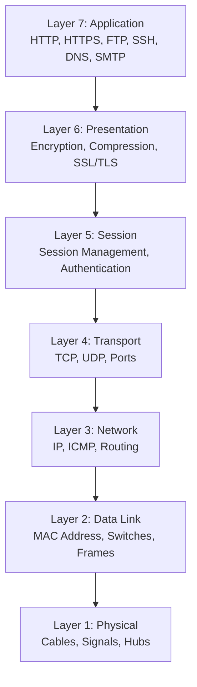
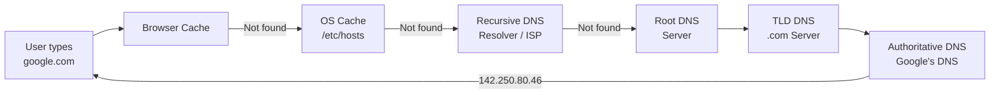
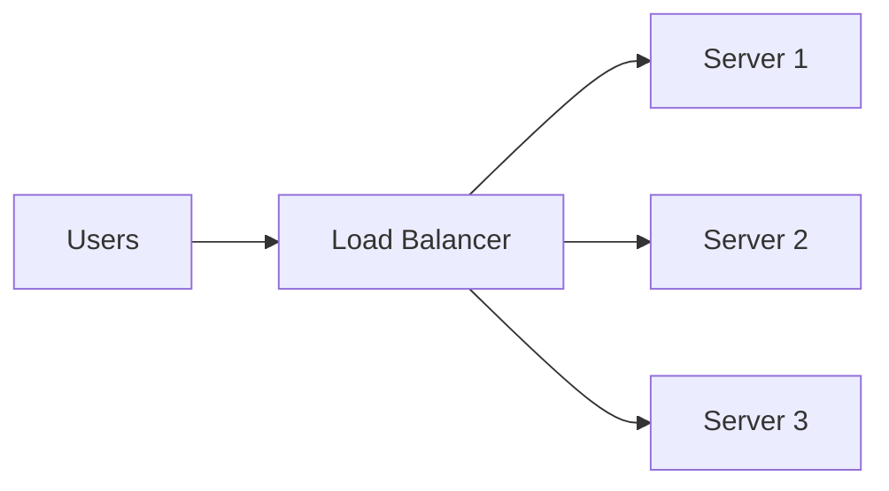

# 🌐 Networking — Complete Revision Guide

> **Networking is the backbone of every DevOps system. No network = No DevOps.**

---

## 📖 What is Computer Networking?

Computer networking is the practice of **connecting computers and devices** to share data, resources, and services. In DevOps, understanding networking is critical for configuring servers, deploying applications, troubleshooting issues, and managing cloud infrastructure.

---

## 🏗️ OSI Model (7 Layers)

The **Open Systems Interconnection** model describes how data travels from one computer to another through a network.



### OSI Layers Explained

| Layer | Name | Function | Protocols/Devices | DevOps Relevance |
|-------|------|----------|-------------------|-----------------|
| **7** | Application | User-facing services | HTTP, HTTPS, DNS, SSH, FTP | Web apps, APIs, SSH access |
| **6** | Presentation | Data format, encryption | SSL/TLS, JPEG, JSON | HTTPS certificates |
| **5** | Session | Manages connections | NetBIOS, RPC | Session management |
| **4** | Transport | End-to-end delivery | TCP, UDP | Port mapping, firewalls |
| **3** | Network | Routing & IP addressing | IP, ICMP, Routers | IP configuration, routing |
| **2** | Data Link | Local network delivery | Ethernet, MAC, Switches | VM networking |
| **1** | Physical | Physical transmission | Cables, Hubs, WiFi | Data center hardware |

### Memory Trick

```
From Layer 7 to 1: "All People Seem To Need Data Processing"
From Layer 1 to 7: "Please Do Not Throw Sausage Pizza Away"
```

---

## 🌐 TCP/IP Model (4 Layers)

The practical model used on the internet.

| TCP/IP Layer | OSI Equivalent | Protocols |
|-------------|----------------|-----------|
| **Application** | Layers 5, 6, 7 | HTTP, HTTPS, SSH, DNS, FTP, SMTP |
| **Transport** | Layer 4 | TCP, UDP |
| **Internet** | Layer 3 | IP, ICMP, ARP |
| **Network Access** | Layers 1, 2 | Ethernet, WiFi, MAC |

---

## 📡 Key Protocols Explained

### TCP vs UDP

| Feature | TCP | UDP |
|---------|-----|-----|
| **Full Name** | Transmission Control Protocol | User Datagram Protocol |
| **Connection** | Connection-oriented (3-way handshake) | Connectionless |
| **Reliability** | ✅ Guaranteed delivery | ❌ No guarantee |
| **Order** | ✅ Maintains packet order | ❌ No ordering |
| **Speed** | Slower (due to checks) | Faster |
| **Error Checking** | ✅ Yes, with retransmission | Minimal |
| **Use Cases** | HTTP, SSH, FTP, Email | DNS, Video streaming, Gaming |

### TCP 3-Way Handshake

```
Client                Server
  |                      |
  |--- SYN ------------>|   (1. Client initiates connection)
  |                      |
  |<--- SYN + ACK ------|   (2. Server acknowledges)
  |                      |
  |--- ACK ------------>|   (3. Client confirms — Connection established!)
  |                      |
  |<==== DATA =========>|   (Data transfer begins)
  |                      |
  |--- FIN ------------>|   (Connection termination)
  |<--- ACK ------------|
```

---

### HTTP vs HTTPS

| Feature | HTTP | HTTPS |
|---------|------|-------|
| **Full Name** | HyperText Transfer Protocol | HTTP Secure |
| **Port** | 80 | 443 |
| **Security** | ❌ Not encrypted | ✅ Encrypted (SSL/TLS) |
| **Certificate** | Not required | SSL/TLS certificate required |
| **URL** | `http://` | `https://` |
| **Data Transfer** | Plain text | Encrypted |
| **Use Case** | Development only | Production websites |

### How HTTPS Works

```
1. Client connects to server on port 443
2. Server sends its SSL/TLS certificate
3. Client verifies certificate with Certificate Authority (CA)
4. Client and server agree on encryption key (TLS handshake)
5. All data is encrypted during transfer
```

---

### DNS (Domain Name System)

DNS translates **domain names** (google.com) into **IP addresses** (142.250.80.46).



### DNS Record Types

| Record | Purpose | Example |
|--------|---------|---------|
| **A** | Maps domain to IPv4 address | `google.com → 142.250.80.46` |
| **AAAA** | Maps domain to IPv6 address | `google.com → 2607:f8b0::` |
| **CNAME** | Alias for another domain | `www.google.com → google.com` |
| **MX** | Mail server for domain | `gmail.com → mail.google.com` |
| **NS** | Nameserver for domain | `google.com → ns1.google.com` |
| **TXT** | Text records (verification) | SPF, DKIM records |
| **PTR** | Reverse DNS (IP → domain) | `142.250.80.46 → google.com` |
| **SOA** | Start of Authority | Primary DNS info |

---

### SSH (Secure Shell)

| Feature | Details |
|---------|---------|
| **Port** | 22 |
| **Purpose** | Secure remote access to servers |
| **Authentication** | Password or SSH key pair |
| **Encryption** | End-to-end encrypted |

```bash
# Connect to server
ssh user@192.168.1.100
ssh -p 2222 user@server          # Custom port
ssh -i key.pem ec2-user@ip       # AWS EC2 connection

# Generate SSH keys
ssh-keygen -t rsa -b 4096
ssh-keygen -t ed25519            # Modern, preferred
```

---

## 🔌 Port Numbers — Complete Reference

### Well-Known Ports (0-1023)

| Port | Service | Protocol | Description |
|------|---------|----------|-------------|
| **20** | FTP Data | TCP | File Transfer (data channel) |
| **21** | FTP Control | TCP | File Transfer (command channel) |
| **22** | SSH | TCP | Secure Shell |
| **23** | Telnet | TCP | Remote access (insecure) |
| **25** | SMTP | TCP | Email sending |
| **53** | DNS | TCP/UDP | Domain name resolution |
| **67/68** | DHCP | UDP | IP address assignment |
| **80** | HTTP | TCP | Web traffic (unencrypted) |
| **110** | POP3 | TCP | Email retrieval |
| **143** | IMAP | TCP | Email access |
| **443** | HTTPS | TCP | Web traffic (encrypted) |

### Application Ports (Commonly Used)

| Port | Service | Description |
|------|---------|-------------|
| **3000** | Node.js / React | Development server |
| **3306** | MySQL | Database server |
| **5432** | PostgreSQL | Database server |
| **5672** | RabbitMQ | Message broker |
| **6379** | Redis | Cache server |
| **8080** | HTTP Alt / Tomcat | Alternative HTTP / Java |
| **8443** | HTTPS Alt | Alternative HTTPS |
| **9090** | Prometheus | Monitoring |
| **9200** | Elasticsearch | Search engine |
| **27017** | MongoDB | NoSQL database |

---

## 🏠 IP Addressing

### IPv4 vs IPv6

| Feature | IPv4 | IPv6 |
|---------|------|------|
| **Format** | `192.168.1.100` | `2001:0db8:85a3::8a2e:0370:7334` |
| **Size** | 32 bits | 128 bits |
| **Addresses** | ~4.3 billion | ~340 undecillion |
| **Notation** | Dotted decimal | Hexadecimal with colons |
| **Example** | `10.0.0.1` | `fe80::1` |

### IP Address Classes

| Class | Range | Default Subnet | Purpose |
|-------|-------|-----------------|---------|
| **A** | 1.0.0.0 – 126.255.255.255 | 255.0.0.0 (/8) | Large networks |
| **B** | 128.0.0.0 – 191.255.255.255 | 255.255.0.0 (/16) | Medium networks |
| **C** | 192.0.0.0 – 223.255.255.255 | 255.255.255.0 (/24) | Small networks |

### Private IP Ranges (RFC 1918)

| Class | Range | Common Use |
|-------|-------|-----------|
| **A** | `10.0.0.0 – 10.255.255.255` | Cloud VPCs, corporate |
| **B** | `172.16.0.0 – 172.31.255.255` | Docker default range |
| **C** | `192.168.0.0 – 192.168.255.255` | Home/office networks |

### Special IP Addresses

| Address | Purpose |
|---------|---------|
| `127.0.0.1` | Localhost (loopback) |
| `0.0.0.0` | All interfaces (bind to all) |
| `255.255.255.255` | Broadcast address |
| `169.254.x.x` | APIPA (auto-assigned when no DHCP) |
| `8.8.8.8` | Google's public DNS |
| `1.1.1.1` | Cloudflare's public DNS |

---

## 🔀 Subnetting Basics

### CIDR Notation

| CIDR | Subnet Mask | Usable Hosts | Description |
|------|-------------|--------------|-------------|
| `/8` | 255.0.0.0 | 16,777,214 | Class A |
| `/16` | 255.255.0.0 | 65,534 | Class B |
| `/24` | 255.255.255.0 | 254 | Class C (most common) |
| `/25` | 255.255.255.128 | 126 | Half of /24 |
| `/26` | 255.255.255.192 | 62 | Quarter of /24 |
| `/27` | 255.255.255.224 | 30 | Small subnet |
| `/28` | 255.255.255.240 | 14 | Very small subnet |
| `/32` | 255.255.255.255 | 1 | Single host |

### Example

```
Network: 192.168.1.0/24
Subnet Mask: 255.255.255.0
Network Address: 192.168.1.0
First Host: 192.168.1.1
Last Host: 192.168.1.254
Broadcast: 192.168.1.255
Usable Hosts: 254
```

---

## 🔥 Firewalls & Security Groups

### What is a Firewall?

A firewall controls **incoming and outgoing network traffic** based on predefined rules. It acts as a barrier between trusted and untrusted networks.

### Linux Firewall (UFW)

```bash
# Status
sudo ufw status
sudo ufw status verbose

# Enable/Disable
sudo ufw enable
sudo ufw disable

# Allow/Deny
sudo ufw allow 22               # Allow SSH
sudo ufw allow 80               # Allow HTTP
sudo ufw allow 443              # Allow HTTPS
sudo ufw allow 3000             # Allow custom port
sudo ufw deny 23                # Deny Telnet
sudo ufw allow from 192.168.1.0/24   # Allow specific network

# Delete rules
sudo ufw delete allow 80
```

### Linux Firewall (iptables)

```bash
# List rules
sudo iptables -L -n

# Allow SSH
sudo iptables -A INPUT -p tcp --dport 22 -j ACCEPT

# Allow HTTP
sudo iptables -A INPUT -p tcp --dport 80 -j ACCEPT

# Block IP
sudo iptables -A INPUT -s 192.168.1.100 -j DROP
```

### AWS Security Groups

| Rule Type | Protocol | Port | Source | Action |
|-----------|----------|------|--------|--------|
| Inbound | TCP | 22 | My IP | Allow SSH |
| Inbound | TCP | 80 | 0.0.0.0/0 | Allow HTTP |
| Inbound | TCP | 443 | 0.0.0.0/0 | Allow HTTPS |
| Outbound | All | All | 0.0.0.0/0 | Allow All |

---

## ⚖️ Load Balancers

### What is Load Balancing?

Load balancing distributes incoming traffic across multiple servers to ensure **high availability, reliability, and performance**.



### Load Balancing Algorithms

| Algorithm | Description |
|-----------|-------------|
| **Round Robin** | Distributes requests sequentially to each server |
| **Least Connections** | Sends to server with fewest active connections |
| **IP Hash** | Routes based on client IP (session persistence) |
| **Weighted Round Robin** | Higher-capacity servers get more requests |
| **Random** | Random server selection |

### Types of Load Balancers

| Type | Layer | Description |
|------|-------|-------------|
| **L4 (Transport)** | Layer 4 | Routes based on IP/Port (TCP/UDP) |
| **L7 (Application)** | Layer 7 | Routes based on content (URL, headers, cookies) |

---

## 🛠️ Network Troubleshooting Commands

### Complete Command Reference

```bash
# 1. Check connectivity
ping google.com                # Test basic connectivity
ping -c 4 8.8.8.8             # Send exactly 4 packets

# 2. Trace route
traceroute google.com          # Show packet path (Linux)
tracert google.com             # Show packet path (Windows)

# 3. DNS lookup
nslookup google.com            # Basic DNS query
dig google.com                 # Detailed DNS information
dig google.com +short          # Just the IP address
dig google.com MX              # Mail server records
host google.com                # Simple DNS lookup

# 4. HTTP requests
curl http://localhost           # Simple GET request
curl -I https://google.com     # Headers only
curl -X POST -d "data" URL     # POST request
curl -v https://google.com     # Verbose (debug)
wget https://example.com/file  # Download file

# 5. Port & Connection check
ss -tulnp                      # Show all listening ports
netstat -tulnp                 # Show ports (legacy)
lsof -i :80                   # What's using port 80
telnet google.com 80           # Test specific port
nc -zv google.com 80           # Netcat port check

# 6. Network interfaces
ip a                           # Show IP addresses
ip addr show                   # Same as above
ifconfig                       # Legacy IP info
ip route show                  # Show routing table
route -n                       # Legacy routing table

# 7. ARP & MAC
arp -a                         # Show ARP cache
ip neigh show                  # Modern ARP table

# 8. Bandwidth & Performance
iperf3 -s                      # Server mode
iperf3 -c server_ip            # Client mode (test bandwidth)
mtr google.com                 # Combined ping + traceroute
```

---

## 🔄 Proxy & Reverse Proxy

### Forward Proxy vs Reverse Proxy

| Feature | Forward Proxy | Reverse Proxy |
|---------|--------------|---------------|
| **Position** | In front of clients | In front of servers |
| **Who uses** | Clients | Servers |
| **Purpose** | Privacy, filtering, caching | Load balancing, SSL, caching |
| **Hides** | Client identity | Server identity |
| **Example** | Corporate proxy, VPN | Nginx, HAProxy |

### Reverse Proxy Architecture

```
Client → [Nginx Reverse Proxy] → Backend Server 1 (Node.js :3000)
                                → Backend Server 2 (Node.js :3001)
                                → Backend Server 3 (Node.js :3002)
```

---

## ⚡ Quick Reference Cheat Sheet

| Task | Command |
|------|---------|
| Check connectivity | `ping google.com` |
| Trace packet path | `traceroute google.com` |
| DNS lookup | `nslookup google.com` |
| Check open ports | `ss -tulnp` |
| HTTP request | `curl http://localhost` |
| Show IP address | `ip a` |
| Check routing table | `ip route show` |
| Download file | `wget URL` |
| Show network interfaces | `ifconfig` |
| Test specific port | `nc -zv host port` |

---

## 🎯 Interview Questions & Answers

### Q1: What is DNS?
**A:** DNS (Domain Name System) is the "phonebook of the internet." It translates human-readable domain names (google.com) into machine-readable IP addresses (142.250.80.46). The resolution process goes through: Browser cache → OS cache → Recursive resolver → Root server → TLD server → Authoritative server.

### Q2: What is the difference between TCP and UDP?
**A:** TCP is connection-oriented (uses 3-way handshake), guarantees delivery and packet order, used for HTTP/SSH/FTP. UDP is connectionless, faster but doesn't guarantee delivery or order, used for DNS/streaming/gaming.

### Q3: What is the OSI Model?
**A:** The OSI model is a conceptual framework with 7 layers that describes how data travels through a network: Physical → Data Link → Network → Transport → Session → Presentation → Application. Each layer has specific protocols and functions.

### Q4: What is the difference between HTTP and HTTPS?
**A:** HTTP transfers data in plain text (port 80), while HTTPS encrypts data using SSL/TLS certificates (port 443). HTTPS is mandatory for production websites as it protects data from eavesdropping and man-in-the-middle attacks.

### Q5: What is a Subnet?
**A:** A subnet divides a large network into smaller, manageable sub-networks. Subnetting helps with network organization, security isolation, and efficient IP allocation. CIDR notation (e.g., /24 = 254 hosts) defines subnet size.

### Q6: What is the TCP 3-Way Handshake?
**A:** It's the process TCP uses to establish a connection:
1. **SYN**: Client sends synchronization request to server
2. **SYN-ACK**: Server acknowledges and sends its own sync
3. **ACK**: Client confirms — connection is now established

### Q7: What is a Firewall?
**A:** A firewall is a network security device/software that monitors and controls incoming/outgoing network traffic based on predefined rules. In DevOps, we use UFW/iptables on Linux and Security Groups in cloud (AWS). It's essential for protecting servers from unauthorized access.

### Q8: What is the difference between Public IP and Private IP?
**A:**
- **Public IP**: Globally unique, routable on the internet, assigned by ISP
- **Private IP**: Used within local/internal networks (10.x.x.x, 172.16-31.x.x, 192.168.x.x), not routable on internet
NAT (Network Address Translation) translates private IPs to public IPs for internet access.

### Q9: What is a Load Balancer?
**A:** A load balancer distributes incoming traffic across multiple servers to ensure high availability and reliability. It prevents any single server from being overloaded. Types: L4 (transport layer, based on IP/port) and L7 (application layer, based on URL/headers).

### Q10: What is a Reverse Proxy?
**A:** A reverse proxy sits in front of backend servers and forwards client requests to them. Benefits: load balancing, SSL termination, caching, security (hides backend servers), and rate limiting. Nginx and HAProxy are popular reverse proxies.

### Q11: What is NAT?
**A:** NAT (Network Address Translation) translates private IP addresses to a public IP address and vice versa. It allows multiple devices on a private network to share a single public IP for internet access. This is why home networks work with one ISP-assigned IP.

### Q12: What is DHCP?
**A:** DHCP (Dynamic Host Configuration Protocol) automatically assigns IP addresses, subnet masks, gateways, and DNS servers to devices on a network. Without DHCP, you'd have to manually configure every device's network settings.

### Q13: What is ARP?
**A:** ARP (Address Resolution Protocol) maps IP addresses (Layer 3) to MAC addresses (Layer 2). When a device wants to communicate on a local network, it uses ARP to discover the MAC address of the destination IP.

### Q14: What is the difference between a Switch and a Router?
**A:**
| Device | Layer | Function |
|--------|-------|----------|
| **Switch** | Layer 2 | Connects devices within the same network using MAC addresses |
| **Router** | Layer 3 | Connects different networks using IP addresses, handles routing |

### Q15: What are the common network troubleshooting steps?
**A:**
1. `ping` — Check basic connectivity
2. `traceroute` — Find where packets are dropping
3. `nslookup/dig` — Verify DNS resolution
4. `ss -tulnp` — Check if service is listening on the expected port
5. `curl` — Test HTTP connectivity to the service
6. `iptables/ufw` — Check firewall rules
7. Check application logs for errors

### Q16: What is CIDR notation?
**A:** CIDR (Classless Inter-Domain Routing) notation represents IP addresses and their subnet mask in a compact format. Example: `192.168.1.0/24` means the first 24 bits are the network portion, leaving 8 bits for hosts (254 usable addresses).

### Q17: What is the difference between Layer 4 and Layer 7 Load Balancing?
**A:**
- **L4**: Operates at transport layer, routes based on IP/port only, faster, simpler
- **L7**: Operates at application layer, can route based on URL path, headers, cookies, content type — more flexible and intelligent

### Q18: What is VPN?
**A:** VPN (Virtual Private Network) creates an encrypted tunnel between your device and a remote network, allowing secure access to internal resources over the public internet. Used for remote work, accessing cloud VPCs, and network security.

### Q19: What is the difference between Stateful and Stateless Firewalls?
**A:**
- **Stateful**: Tracks connection state, allows return traffic automatically, more secure (AWS Security Groups)
- **Stateless**: Evaluates each packet independently, requires explicit rules for both directions (AWS NACLs)

### Q20: What is latency vs bandwidth vs throughput?
**A:**
- **Latency**: Time for a packet to travel from source to destination (measured in ms)
- **Bandwidth**: Maximum capacity of network link (measured in Mbps/Gbps)
- **Throughput**: Actual data transfer rate at a given moment (always ≤ bandwidth)

---

## 💡 Networking Best Practices for DevOps

```
✅ Always use HTTPS in production
✅ Open only required ports (principle of least privilege)
✅ Use private subnets for databases and internal services
✅ Implement load balancing for high availability
✅ Use DNS instead of hardcoded IPs
✅ Monitor network performance and latency
✅ Use VPNs for secure remote access
✅ Document your network architecture
✅ Implement proper firewall rules
✅ Use reverse proxies for backend protection
```

---

> 🚀 *"Understanding networking is what separates a good DevOps engineer from a great one."*