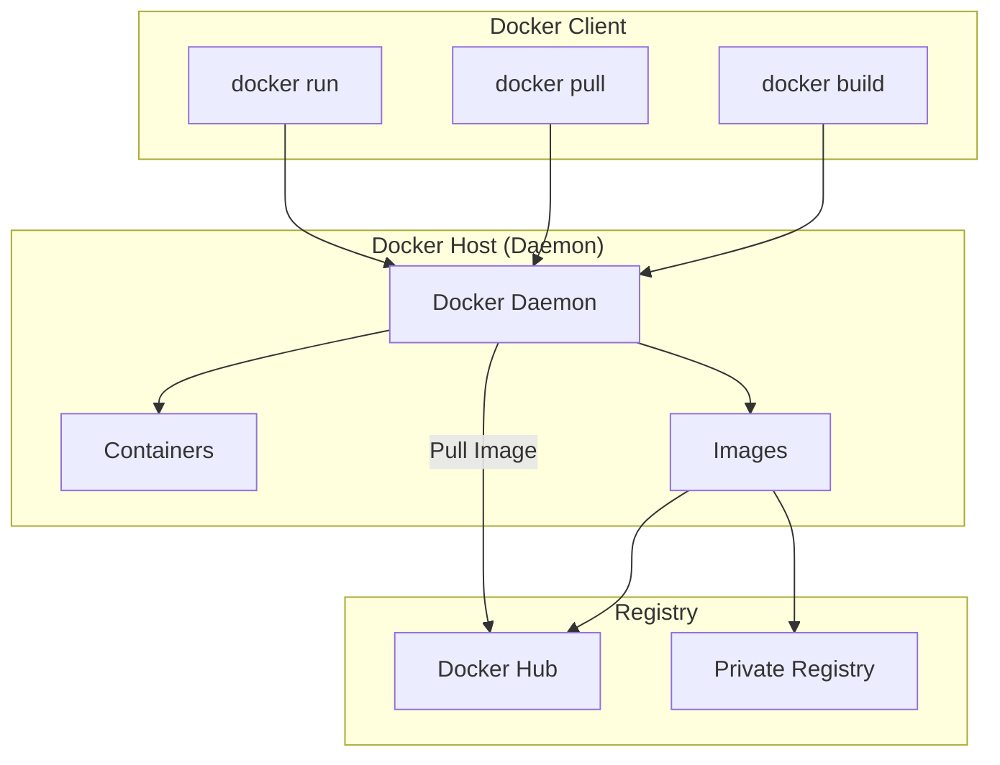
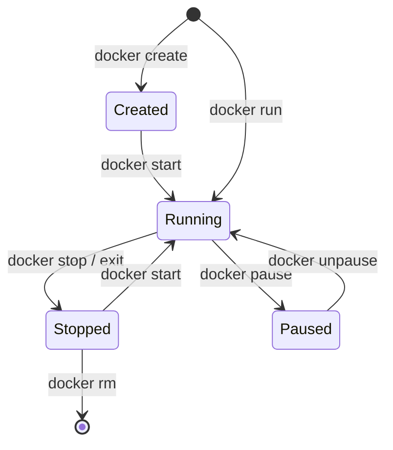

# 🚀 Docker Fundamentals — Complete Revision Guide

> **"Build once, run anywhere."** Docker solves the classic developer excuse: *"But it works on my machine!"*

---

## 📖 Containerization vs. Virtualization

To understand Docker, we must first understand the shift from **Virtual Machines (VMs)** to **Containers**.

### Virtual Machines (Hardware-Level Virtualization)
Virtual Machines run on top of a physical server using a **Hypervisor** (e.g., VMware, VirtualBox). Each VM requires a complete **Guest Operating System**, virtualized hardware drivers, and application binaries. 
- **Drawbacks:** Slow boot times (minutes), heavy resource footprint (GBs of RAM/disk per VM), and high licensing costs.

### Containers (OS-Level Virtualization)
Containers share the host operating system's kernel and isolate user space. They run as lightweight processes on the host OS managed by a **Container Engine** (like Docker).
- **Benefits:** Instant boot times (milliseconds), extremely lightweight (MBs of disk/RAM), and high density (run hundreds of containers on one host).

### Comparison Table

| Feature | Virtual Machines (VMs) | Containers (Docker) |
|---|---|---|
| **Architecture** | Guest OS on Hypervisor | Shared Host OS Kernel |
| **Boot Time** | Minutes | Milliseconds |
| **Size** | Gigabytes (GB) | Megabytes (MB) |
| **Performance** | Near-native (slight hypervisor overhead) | Native speed |
| **Isolation** | Strong (hardware-level) | Process-level (namespace/cgroups) |
| **Scalability** | Slow & resource-heavy | Rapid & highly efficient |

---

## 🏗️ Docker Architecture

Docker uses a **Client-Server** architecture. The Docker Client talks to the Docker Daemon, which does the heavy lifting of building, running, and distributing your containers.



### Core Components

1. **Docker Client (`docker`)**: The command-line interface (CLI) that allows users to interact with the Docker Daemon. Commands like `docker run` are sent to `dockerd`.
2. **Docker Host / Daemon (`dockerd`)**: A background service running on the host machine. It listens for Docker API requests and manages Docker objects such as images, containers, networks, and volumes.
3. **Docker Registry**: A registry stores Docker images. **Docker Hub** is the default public registry, but organizations can run private registries (e.g., AWS ECR, JFrog).
4. **Docker Images**: Read-only templates with instructions for creating a Docker container. Images are built in layers.
5. **Docker Containers**: Runnable instances of an image. They are isolated, secure, and run application code.

### Inside the Docker Engine: `containerd` & `runc`
Modern Docker engines don't directly run containers. They delegate tasks:
- **`dockerd`**: Handles high-level logic (API, authentication, network/volume creation).
- **`containerd`**: Manages the container lifecycle (pushes/pulls images, manages storage/networks).
- **`runc`**: The OCI (Open Container Initiative) compliant runtime that talks directly to the Linux kernel to spin up namespaces, cgroups, and start the container process, then exits.

---

## ⚙️ Docker Isolation Mechanics (Kernel Features)

Docker relies on two core Linux kernel features to achieve process isolation:

1. **Namespaces (What the container can see)**:
   - **`pid`**: Isolates process IDs (container thinks its process is PID 1).
   - **`net`**: Isolates network interfaces.
   - **`mnt`**: Isolates filesystem mount points.
   - **`ipc`**: Isolates System V IPC and POSIX message queues.
   - **`uts`**: Isolates hostnames and domain names.
   - **`user`**: Isolates user and group IDs.

2. **Control Groups / cgroups (What the container can use)**:
   - Limits and monitors resource usage (CPU, Memory, Disk I/O, Network bandwidth) to prevent a single container from crashing the host (Noisy Neighbor problem).

---

## 🔁 Docker Lifecycle

The container lifecycle outlines the different states a container can transit through:



---

## ⚡ Quick Reference Cheat Sheet

```
Docker            = Platform for containerizing apps
VM                = Hardware virtualization (heavy, Guest OS)
Container         = OS virtualization (lightweight, shared kernel)
dockerd           = Docker daemon running on host
Docker Hub        = Default image registry
Namespaces        = Provides ISOLATION (pid, net, mnt, ipc, uts, user)
Cgroups           = Provides RESOURCE LIMITS (CPU, Memory)
runc              = Low-level OCI container creator
containerd        = High-level container runtime manager
```

---

## 🎯 Interview Questions & Answers

### Q1: What is the main difference between a Virtual Machine and a Docker Container?
**A:** A VM virtualizes the underlying physical hardware and requires a complete Guest OS to run. A Docker container virtualizes the Host OS kernel directly, sharing it with other containers. Consequently, containers are much smaller (MBs vs GBs), boot instantly (seconds vs minutes), and run with near-zero performance overhead compared to VMs.

### Q2: What Linux kernel features enable Docker containers to work?
**A:** Docker relies on two primary Linux Kernel features:
1. **Namespaces:** Provide isolation (e.g., processes, network interfaces, mount points, hostnames) so each container feels like a separate OS.
2. **Control Groups (cgroups):** Enforce resource limits (CPU, memory, disk I/O) on containers to prevent one container from hogging all host resources.

### Q3: What is the difference between a Docker Image and a Docker Container?
**A:** A **Docker Image** is a read-only, immutable template containing the application code, runtime environment, libraries, and configurations. A **Docker Container** is a running, writeable instance of an image. You can run multiple containers from a single image.

### Q4: Explain the role of `dockerd`, `containerd`, and `runc` in Docker.
**A:** 
- `dockerd` (Docker Daemon) accepts user requests via the Docker CLI and manages high-level tasks like image building and volume orchestration.
- `containerd` is a daemon that manages the lifecycle of containers (fetching images, supervising execution).
- `runc` is the low-level command-line tool that actually spawns the container by communicating with the Linux kernel (namespaces/cgroups) and then exits.

### Q5: What is Docker Hub?
**A:** Docker Hub is the default public, cloud-based registry service provided by Docker. It allows developers to store, share, and pull container images. It hosts official images for common software like Nginx, Node.js, Python, PostgreSQL, etc.

### Q6: What does the "Noisy Neighbor" problem mean, and how does Docker prevent it?
**A:** The "Noisy Neighbor" problem occurs when one application or container consumes all available system resources (CPU, Memory, Bandwidth), starving other services on the same host. Docker prevents this using Linux **Control Groups (cgroups)**, which allow administrators to set hard limits on how much CPU, memory, and I/O a container can use.

### Q7: Are containers secure? How do they compare to VMs in security?
**A:** VMs generally offer stronger security isolation because they isolate at the hardware level with a hypervisor. Containers share the host kernel; if a container exploits a kernel vulnerability, it could compromise the host and other containers. However, Docker enforces security using namespaces, cgroups, capability drops (limiting root powers), and tools like AppArmor/SELinux to minimize risks.

### Q8: What is the difference between `docker run` and `docker start`?
**A:**
- `docker run` creates a **new container** from an image and starts it.
- `docker start` starts an **existing, stopped container** without creating a new one.

### Q9: Can a Docker container run a Windows application on a Linux host?
**A:** No, because containers share the host kernel. A Linux host only provides a Linux kernel. Running a Windows container requires a Windows host kernel. However, tools like Docker Desktop on Windows use a lightweight utility VM (like WSL2) to run a Linux kernel, allowing Linux containers to run on a Windows machine.

### Q10: What is the OCI?
**A:** OCI stands for **Open Container Initiative**. It is a governance structure established in 2015 to create open industry standards for container formats and runtimes, ensuring that images and containers can work seamlessly across different engines (like Docker, Podman, and Kubernetes).

---

## 💡 Key Takeaways

```
✅ Docker makes application environments reproducible and portable.
✅ Sharing the host OS kernel makes containers fast and lightweight.
✅ Namespaces isolate visibility; cgroups isolate resource consumption.
✅ Images are read-only build artifacts; containers are read-write runtime environments.
✅ Docker adheres to Open Container Initiative (OCI) standards.
```

---

> 🚀 *"Containers are not light Virtual Machines. They are isolated processes running on the host OS."*