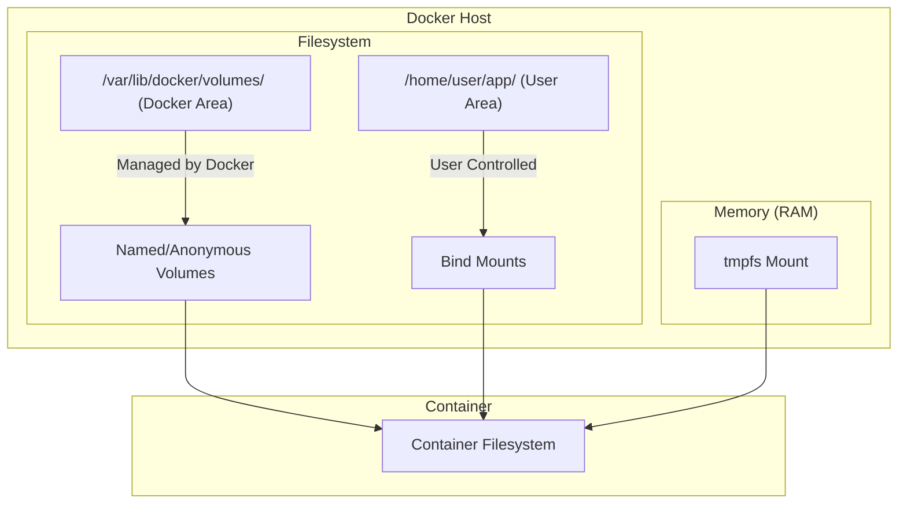

# 🐳 Docker Volumes — Complete Revision Guide

> **"Data outlives containers."** A deep dive into container ephemeral storage, named volumes, bind mounts, and best practices for running stateful applications.

---

## 📖 Why Do We Need Volumes?

By default, container filesystems are **ephemeral** (temporary).
- **Union File System (UFS)**: Containers use a copy-on-write storage model. When a container writes or modifies a file, it copies it from the read-only image layer into its own writable container layer.
- **The Issue**: Once the container is deleted (`docker rm`), the writable layer is completely destroyed. Any databases, logs, or user uploads are lost forever.
- **The Solution**: Mount external storage directories from the host machine into the container. This bypasses the Union File System and writes data directly to the host disk at native speeds.

---

## 📁 Storage Options in Docker

Docker offers four main ways to persist or share data:



### Detailed Breakdown

| Type | Managed By | Path on Host | Best Use Case |
|---|---|---|---|
| **Named Volume** | Docker | `/var/lib/docker/volumes/<name>/` | Database storage (Postgres, Mongo), persisting application files in production. |
| **Anonymous Volume** | Docker | `/var/lib/docker/volumes/<hash>/` | Temporary directory storage where name doesn't matter (deleted on `rm -v`). |
| **Bind Mount** | User | Any directory (e.g. `/home/user/code/`) | Mounting local source code for live-reloading during development. |
| **tmpfs Mount** | Host RAM | None (stored in host memory) | High-security key storage or caching; data is deleted when container stops. |

---

## ⚙️ Mounting Syntax: `-v` vs. `--mount`

Docker provides two flags to mount storage. While `-v` is short and common, `--mount` is preferred in production due to its explicit configuration structure.

### 1. Legacy `-v` or `--volume` Syntax
Consists of three fields separated by colons (`:`):
`[host_path_or_volume_name]:[container_path]:[options]`
```bash
# Named Volume:
docker run -d -v my-db-data:/var/lib/mysql mysql
# Bind Mount:
docker run -d -v /home/user/project:/app nginx
```

### 2. Modern `--mount` Syntax
Uses key-value pairs. It is more verbose, explicit, and throws clear errors if paths are missing.
```bash
# Named Volume:
docker run -d --mount type=volume,source=my-db-data,target=/var/lib/mysql mysql
# Bind Mount (Read-Only):
docker run -d --mount type=bind,source=/home/user/project,target=/app,readonly nginx
```
*Note: If you use `-v` and the host directory does not exist, Docker will automatically create it as an empty directory. If you use `--mount type=bind` and the host directory does not exist, Docker will fail with an error.*

---

## 🛠️ Volume Management Commands

Use these commands to configure, monitor, and clean up volumes.

| Command | Purpose | Example |
|---|---|---|
| `docker volume create` | Create a named volume | `docker volume create db_data` |
| `docker volume ls` | List all local volumes | `docker volume ls` |
| `docker volume inspect` | Inspect metadata and get host path | `docker volume inspect db_data` |
| `docker volume rm` | Delete a volume (volume must be unused) | `docker volume rm db_data` |
| `docker volume prune` | Remove all unused volumes | `docker volume prune` |

---

## 📦 Backing Up and Restoring Volumes

Since volumes are managed by Docker, you cannot easily copy them using standard shell tools. A common backup strategy is to run a temporary container that mounts the volume and tarballs its contents:

### Backup Command:
```bash
docker run --rm -v db_data:/volume -v $(pwd):/backup alpine \
  tar -cvf /backup/db_backup.tar -C /volume .
```
*(This mounts `db_data` volume, mounts current working directory to `/backup`, and runs `tar` to pack all volume files into `db_backup.tar` on the host).*

### Restore Command:
```bash
docker run --rm -v db_data:/volume -v $(pwd):/backup alpine \
  tar -xvf /backup/db_backup.tar -C /volume
```

---

## 🎯 Interview Questions & Answers

### Q1: Why are container filesystems considered ephemeral?
**A:** Containers are designed to be stateless and disposable. They write data to a temporary writeable layer managed by the Union File System. When a container is deleted (`docker rm`), this writeable layer is permanently deleted with it, meaning any data created or modified inside the container is lost.

### Q2: What is the difference between a Bind Mount and a Named Volume?
**A:**
- **Named Volume:** Managed completely by Docker and stored in a Docker-specific directory (`/var/lib/docker/volumes/` on Linux). Docker handles creation, storage, and permission management. Decoupled from the host filesystem layout. Best for database persistence.
- **Bind Mount:** Points directly to any file or folder on the host filesystem (e.g. `/home/user/app/code`). The user is responsible for directory existence, permissions, and paths. Best for mounting local source code into development containers for live-reloading.

### Q3: What happens to a volume when a container is deleted?
**A:** Nothing. Volumes are decoupled from containers. When a container is deleted using `docker rm`, the volume remains intact, preserving the data. The volume will only be deleted if it is explicitly removed using `docker volume rm` or if the container is removed using `docker rm -v` (which deletes associated anonymous volumes).

### Q4: What happens if you mount a non-empty volume into a non-empty container directory?
**A:** If you mount an empty or non-empty **volume** to a container directory that already contains files, those container files are automatically copied *into* the volume. However, if you mount a **bind mount** to a container directory, the host files will override and obscure the container files (the container files will be hidden, similar to mounting a physical drive on Linux).

### Q5: How do you mount a volume as read-only? Why would you do this?
**A:** You can mount a volume as read-only by adding `:ro` in the `-v` syntax, or `readonly` in the `--mount` syntax. This is done for security, ensuring that the containerized process can read files (like configuration profiles or certificates) but cannot modify or inject malicious changes back onto the host disk.
```bash
# -v Syntax:
docker run -v config_vol:/app/config:ro nginx
# --mount Syntax:
docker run --mount type=volume,source=config_vol,target=/app/config,readonly nginx
```

### Q6: What is a `tmpfs` mount, and when should it be used?
**A:** A `tmpfs` mount is a temporary volume stored entirely in the host's system memory (RAM). It is never written to the host filesystem. It is ideal for storing sensitive credentials, API keys, or high-speed temporary runtime cache files that should never persist on disk or survive a container shutdown.

### Q7: Can multiple containers share a single volume?
**A:** Yes. Multiple containers can mount the exact same volume simultaneously. This is commonly used for sharing application assets (e.g. a Node.js API container writing files, and an Nginx container serving those static files directly).

### Q8: How can you find the physical location of a Docker volume on the host?
**A:** You can locate the host directory by running the inspect command:
```bash
docker volume inspect <volume_name>
```
Look for the `"Mountpoint"` key in the JSON output, which typically points to `/var/lib/docker/volumes/<volume_name>/_data` on Linux systems.

### Q9: How does Docker copy-on-write (CoW) work?
**A:** Under the Union File System, image layers are read-only. When a container process needs to modify a file inside the image, Docker copies the file from the read-only layer into the container's writable layer first, and then performs the modifications. This prevents files in the base image from being altered.

### Q10: How do you delete all unused volumes to reclaim disk space?
**A:** You can remove all volumes that are not currently attached to any container by running:
```bash
docker volume prune
```

---

## 💡 Key Takeaways

```
✅ Volumes bypass the slow Union File System to deliver native I/O speeds.
✅ Named Volumes are preferred for databases; Bind Mounts are preferred for development.
✅ `--mount` is safer than `-v` because it fails explicitly if a bind path is missing.
✅ Deleting a container does not delete its volumes.
✅ Use 'docker volume prune' to safely clean up unattached volume data.
```

---

> 🚀 *"Treat containers as pets, treat data as family. Keep them separated, and keep your data safe in volumes."*