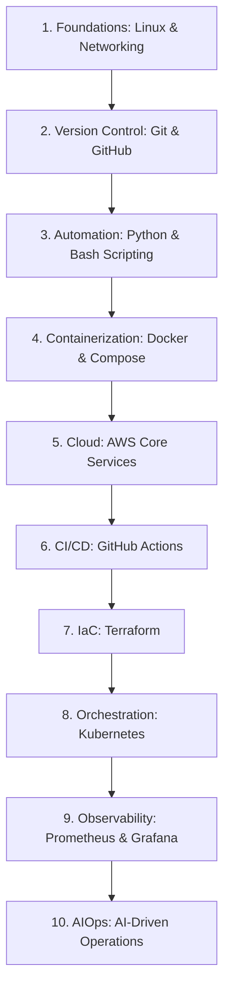

# 🚀 DevOps, Cloud, & AI Roadmap — Complete Revision Guide

> **"The future of Operations is automated, intelligent, and cloud-native."** A comprehensive guide mapping the intersection of cloud engineering, DevOps practices, and generative AI automation.

---

## 🗺️ The Modern DevOps & Cloud Roadmap

Transitioning from a traditional administrator to a Cloud DevOps Engineer requires mastering multiple abstraction layers. The following roadmap outlines the standard progression:



---

## ☁️ AWS Core Services Quick Reference

Amazon Web Services (AWS) is the leading cloud provider. Understanding its baseline infrastructure services is crucial for DevOps engineers.

### 1. Identity & Access Management (IAM)
- **Purpose**: Secures AWS resources by controlling authentication and authorization.
- **Key Concepts**:
  - **Root User**: The initial administrative account. Should not be used for daily tasks.
  - **Users**: Individuals or applications needing access.
  - **Groups**: Collections of users to apply permissions bulk (e.g., "Developers").
  - **Policies**: JSON documents defining allowed/denied actions.
  - **Roles**: Temporary credentials assigned to resources (like an EC2 instance) to call other AWS services securely.

### 2. Compute: EC2 (Elastic Compute Cloud)
- **Purpose**: Provides resizable virtual servers (instances).
- **Key Features**:
  - **Security Groups**: Virtual firewalls controlling inbound and outbound traffic at the instance level.
  - **Key Pairs**: SSH keys used to log in securely to Linux instances.
  - **AMIs (Amazon Machine Images)**: Pre-configured OS templates.

### 3. Storage: S3 (Simple Storage Service)
- **Purpose**: Scalable object storage (files, images, backups, static websites).
- **Key Features**:
  - **Buckets**: Logical containers for storing objects.
  - **Static Website Hosting**: Allows running frontend apps (React, HTML) directly from an S3 bucket with zero server overhead.

### 4. Networking: VPC (Virtual Private Cloud)
- **Purpose**: An isolated virtual network environment inside AWS.
- **Core Components**:
  - **Subnets**: Ranges of IP addresses. Divided into **Public Subnets** (accessible from the internet) and **Private Subnets** (isolated databases/backends).
  - **Internet Gateway (IGW)**: Connects the VPC to the public internet.
  - **Route Tables**: Directions determining where network traffic is directed.

---

## 🤖 The Role of AI in DevOps (AIOps)

Generative AI and Machine Learning are shifting the landscape of system operations:

1. **Coding & Scripting Assistance**: Using tools like GitHub Copilot or Gemini to generate infrastructure-as-code configuration scripts, shell code, and error-handling routines.
2. **Intelligent Monitoring & Alerting**: Traditional alerts trigger on simple thresholds (e.g. CPU > 80%). AIOps uses machine learning to detect anomalies, predicting crashes before they happen.
3. **Automated Root Cause Analysis**: Parsing thousands of lines of container logs to isolate the exact error trace causing an outage.
4. **Cloud Cost Optimization**: Using AI suggestions to right-size EC2 instances and clean up unused volumes, reducing infrastructure bills.

---

## 🎯 Interview Questions & Answers

### Q1: What is the principle of least privilege in AWS IAM?
**A:** The principle of least privilege states that users, roles, and applications should only be granted the minimum permissions necessary to perform their specific tasks. This minimizes the security blast radius in case credentials are compromised.

### Q2: What is the difference between AWS Security Groups and Network Access Control Lists (NACLs)?
**A:**
- **Security Groups:** Act as a virtual firewall for individual **instances** (stateful — if inbound traffic is allowed, outbound is automatically allowed).
- **NACLs:** Act as a firewall at the **subnet level** (stateless — you must explicitly configure both inbound and outbound traffic rules).

### Q3: What is the difference between an IAM User and an IAM Role?
**A:**
- **IAM User:** A permanent credential (username/password or API access keys) associated with a specific person or service.
- **IAM Role:** A set of permissions that can be assumed temporarily by anyone or anything that needs it (like an EC2 instance or an external AWS account). It does not use permanent passwords or access keys.

### Q4: Explain the difference between public and private subnets in an AWS VPC.
**A:**
- **Public Subnet:** Has a route table pointing directly to an **Internet Gateway (IGW)**, allowing resources (like web servers) to receive public internet IPs and communicate with the outside world.
- **Private Subnet:** Does not have a direct route to the internet gateway. Resources (like databases) are completely hidden from the internet. They can only access the internet outbound via a **NAT Gateway** located in a public subnet.

### Q5: How can you host a static website on AWS with the lowest cost and highest availability?
**A:** By using **Amazon S3** static website hosting. You upload your HTML, CSS, and JS files to an S3 bucket, configure the bucket for static hosting, and enable public read access. For production, you front it with **Amazon CloudFront** (AWS CDN) to cache the pages globally and install SSL (HTTPS) certificates.

### Q6: What is Infrastructure as Code (IaC) and why is it important in the Cloud?
**A:** IaC is the practice of managing and provisioning cloud infrastructure using machine-readable configuration files (e.g. Terraform, AWS CloudFormation) rather than manually clicking on the cloud console. It ensures that environments are reproducible, version-controlled, automated, and free from human deployment error.

### Q7: What does "AIOps" mean?
**A:** AIOps stands for **Artificial Intelligence for IT Operations**. It refers to using machine learning, big data, and natural language processing to automate IT operations processes. This includes parsing system logs, detecting anomalous resource spikes, correlation of alert noise, and automating incident response.

### Q8: What is the difference between vertical scaling and horizontal scaling?
**A:**
- **Vertical Scaling (Scaling Up):** Adding more power (CPU, RAM) to an existing server (e.g., upgrading an EC2 instance from `t2.micro` to `t2.large`). It has limits and requires downtime.
- **Horizontal Scaling (Scaling Out):** Adding more server instances to your application stack (e.g., running 5 identical EC2 instances behind an Application Load Balancer). It offers high availability and infinite scale.

### Q9: What is the AWS Shared Responsibility Model?
**A:** It defines which security controls AWS manages vs what the customer manages:
- **AWS is responsible for "Security OF the Cloud":** Physical security of data centers, hardware, virtualization hypervisors, and core networking.
- **The Customer is responsible for "Security IN the Cloud":** Guest operating system patching, application code, database configuration, IAM access control, and network traffic security.

### Q10: How can LLMs assist a DevOps engineer in daily operations?
**A:** Large Language Models (LLMs) assist by:
1. Writing Bash, Python, or Go automation scripts.
2. Generating complex Terraform configurations or Kubernetes manifest files.
3. Troubleshooting error codes and explaining stack traces.
4. Explaining legacy scripts or converting code from one language to another.

---

## 💡 Key Takeaways

```
✅ Secure AWS environments by strictly enforcing IAM policies.
✅ Never hardcode AWS credentials; use IAM Roles instead.
✅ Host static assets on S3, compute tasks on EC2, and private databases in private VPC subnets.
✅ Use IaC (Terraform) to avoid manual configuration drift.
✅ Leverage AI to speed up script writing and diagnose log anomalies.
```

---

> 🚀 *"The cloud provides the infrastructure, DevOps provides the automation, and AI provides the intelligence."*