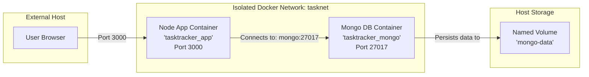

# 🚀 Multi-Container Application — Case Study

> **"From code to containers to stack orchestration."** A hands-on guide analyzing the deployment architecture of a 2-Tier Task Tracker Application using Node.js, MongoDB, and Docker Compose.

---

## 🎯 Project Objective

To build and run a **2-Tier Application** locally, demonstrating:
1. **Containerization** of a Node.js web server.
2. **Database Integration** with an official MongoDB image.
3. **Isolated Networking** so the backend can securely talk to the database.
4. **Data Persistence** using a Docker volume, ensuring tasks aren't lost when containers restart.
5. **Environment Configuration** utilizing variables for connection string decoupling.

---

## 🏗️ Application Architecture

The application topology consists of a user client browser, an Express backend container, and a MongoDB database engine container.



---

## 📂 Codebase Breakdown

The project stack comprises the following core configurations (from the `Day-15/Task-Tracker` folder):

### 1. The Containerizer: `Dockerfile`
A lightweight configuration to package the Node.js application.
```dockerfile
FROM node:18-alpine
WORKDIR /app
COPY package*.json ./
RUN npm install
COPY . .
EXPOSE 3000
CMD ["node", "server.js"]
```

### 2. The Orchestrator: `docker-compose.yml`
Bridges the services, networks, and persistent volume.
```yaml
version: '3.8'
services:
  app:
    build: .
    container_name: tasktracker_app
    ports:
      - "3000:3000"
    environment:
      - MONGO_URI=${MONGO_URI}
      - PORT=${PORT}
    depends_on:
      - mongo
    networks:
      - tasknet

  mongo:
    image: mongo:6.0
    container_name: tasktracker_mongo
    restart: unless-stopped
    volumes:
      - mongo-data:/data/db
    networks:
      - tasknet

volumes:
  mongo-data:

networks:
  tasknet:
    driver: bridge
```

---

## ⚙️ Deployment & Verification Guide

Follow these steps to deploy and verify the multi-container application:

### Step 1: Set up the Environment
Create a `.env` file in your application directory to specify database connection secrets:
```text
PORT=3000
MONGO_URI=mongodb://mongo:27017/tasks
```
*(Notice that the connection string uses `mongo` as the host. Docker resolves this to the database container's private IP).*

### Step 2: Spin Up the Stack
Build the Node.js application image and launch the containers in the background:
```bash
docker compose up -d --build
```

### Step 3: Check Stack Status
Verify that both containers are running successfully:
```bash
docker compose ps
```

### Step 4: Monitor Logs
Inspect the initialization logs to verify the backend successfully connected to the MongoDB server:
```bash
docker compose logs -f
```

### Step 5: Test Database Persistence
1. Open your browser and navigate to `http://localhost:3000`.
2. Add a few mock tasks (e.g., "Learn Docker Volumes", "Complete Day-16").
3. Stop and delete the application stack:
   ```bash
   docker compose down
   ```
4. Confirm the containers are gone (`docker ps`).
5. Restart the application:
   ```bash
   docker compose up -d
   ```
6. Refresh the page at `http://localhost:3000`. The tasks will still be visible! This confirms the database writes bypassed the container layer and were safely committed to the `mongo-data` volume on the host disk.

---

## 🎯 Interview Questions & Answers

### Q1: In the MongoDB URI, why did we use `mongodb://mongo:27017` instead of `localhost`?
**A:** Inside a Docker bridge network, `localhost` refers to the loopback address of the individual container itself, not the host machine or other containers. To connect to MongoDB, the app container must route traffic to the database container. Docker Compose automatically maps the service name `mongo` to the database container's internal IP using its embedded DNS server.

### Q2: What happens if the `app` container starts before the `mongo` container is ready to accept connections?
**A:** Although `depends_on` ensures the `mongo` container is launched *first*, it does not wait for the database service to be fully booted and ready to accept TCP connections. If the Node.js app starts and attempts to connect immediately, it might fail and crash. To prevent this:
1. Implement reconnection retry logic in your Node.js application code.
2. Use tool scripts (like `wait-for-it.sh`) to delay the application command.
3. Configure a container Healthcheck on the database and make the app depend on that health state.

### Q3: Why did we specify the `mongo-data` volume? What happens if we omit it?
**A:** MongoDB stores its database files inside the `/data/db` directory inside the container. Since containers are ephemeral, if we omit the volume, any tasks added to our tracker will reside only in the container's writable layer. The moment we run `docker compose down`, the container is destroyed, resulting in permanent database loss. The `mongo-data` volume maps this directory to the host disk, ensuring data survives container lifecycles.

### Q4: How does the `.env` file security mechanism work in Docker Compose?
**A:** Storing database connection strings or ports directly in the `docker-compose.yml` file is a security risk if the file is committed to a public Git repository. Instead, we use shell variables (e.g., `${MONGO_URI}`). Docker Compose looks for a local `.env` file on the filesystem during execution, reads those variables, and injects them securely into the containers at runtime. The `.env` file is added to `.dockerignore` and `.gitignore` to prevent leakage.

### Q5: How can you update the application code and deploy changes without wiping the database?
**A:** Run the upgrade command:
```bash
docker compose up -d --build app
```
This tells Docker Compose to only rebuild the `app` service image and replace its container, leaving the database container (`mongo`) and its associated data volume completely untouched, ensuring zero-downtime database state.

---

## 💡 Key Takeaways

```
✅ Docker Compose facilitates deploying multi-tier applications in seconds.
✅ Decouple connection configuration by leveraging environment variables.
✅ Establish network separation using user-defined bridge networks.
✅ Persist database engines by mapping data directories to named volumes.
✅ Handle database connection resilience inside the application source code.
```

---

> 🚀 *"The beauty of Docker Compose is that it turns a complex deployment runbook into a single, version-controlled YAML file."*